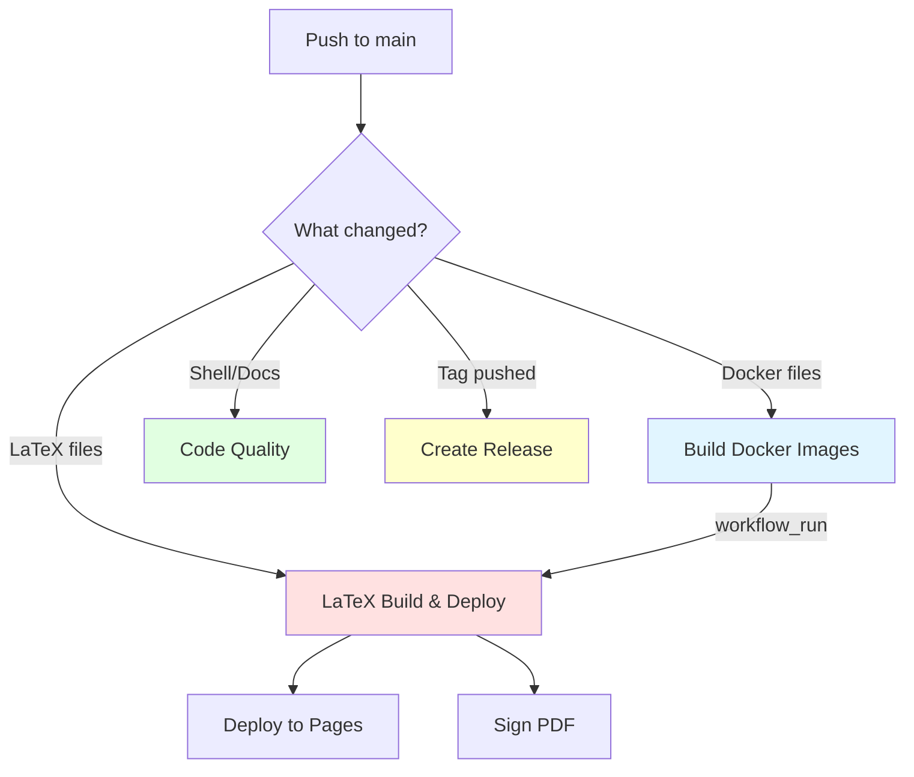

# GitHub Actions Workflow Triggers

**Last Updated:** 2025-11-17
**Audience:** Contributors, Maintainers

This document explains when each GitHub Actions workflow runs and which file changes trigger them.

## Quick Reference

| Workflow | Push to main | Pull Request | Schedule | Manual |
|----------|--------------|--------------|----------|--------|
| **Build Docker Images** | Docker files | Docker files | - | ✅ |
| **LaTeX Build & Deploy** | LaTeX/scripts | LaTeX/scripts | - | ✅ |
| **Code Quality & Security** | Code/docs | Code/docs | Weekly | - |
| **Create Release** | Tags only | - | - | - |

## Workflow Details

### 1. Build Docker Images

**File:** `.github/workflows/docker-build.yml`

**Purpose:** Build and publish Docker images to GHCR with security scanning and signing.

**Triggers on:**

```yaml
push to main:
  - docker/Dockerfile*           # Any Dockerfile changes
  - .github/workflows/docker-build.yml  # Workflow changes
  - .hadolint.yaml               # Linting config changes

pull_request:
  - Same as above

manual:
  - workflow_dispatch (always available)
```

**Why these paths?**
- **Dockerfile changes** → Need to rebuild images
- **Workflow changes** → Need to test workflow modifications
- **Hadolint config** → Linting rules affect build quality

**Downstream effects:**
- ✅ Triggers **LaTeX Build & Deploy** via `workflow_run` (on main only)
- This ensures LaTeX build always uses latest Docker images

---

### 2. LaTeX Build & Deploy

**File:** `.github/workflows/latex-build-deploy.yml`

**Purpose:** Compile LaTeX paper, sign PDF, deploy to GitHub Pages.

**Triggers on:**

```yaml
push to main:
  - src/tex/**                   # LaTeX source files
  - scripts/**                   # Build/verification scripts
  - web/**                       # GitHub Pages content
  - .github/workflows/latex-build-deploy.yml
  # Note: Makefile excluded - handled by workflow_run

pull_request:
  - src/tex/**                   # LaTeX source files
  - scripts/**                   # Build/verification scripts
  - Makefile                     # Build config (included in PRs)
  - web/**                       # GitHub Pages content
  - .github/workflows/latex-build-deploy.yml

workflow_run:
  - After "Build Docker Images" completes (main only)

manual:
  - workflow_dispatch (always available)
```

**Why these paths?**
- **src/tex/** → Paper content changes
- **scripts/** → Build scripts affect compilation
- **web/** → Landing page changes
- **Makefile** → Only in PRs to test changes; on push waits for Docker workflow
- **workflow_run** → Ensures we use freshly built Docker images

**What doesn't trigger this?**
- ❌ Documentation changes (docs/, *.md in root)
- ❌ GitHub community files (.github/SUPPORT.md, CODE_OF_CONDUCT.md, etc.)
- ❌ Linting configs (.markdownlint.yaml, .hadolint.yaml)
- ❌ Docker changes (handled by workflow_run)

**Why not Makefile on push?**
When Makefile changes alongside Docker changes, we'd get:
1. Docker workflow builds new images
2. LaTeX workflow starts with old images (race condition)
3. Docker workflow completes and triggers LaTeX again

Instead, we:
1. Docker workflow builds new images
2. LaTeX workflow waits
3. Docker workflow completes and triggers LaTeX with new images ✅

---

### 3. Code Quality & Security Scanning

**File:** `.github/workflows/codeql.yml`

**Purpose:** Lint shell scripts, Dockerfiles, and markdown documentation.

**Triggers on:**

```yaml
push to main:
  - scripts/**                   # Shell scripts (ShellCheck)
  - docker/**                    # Dockerfiles (Hadolint)
  - .github/workflows/**         # Workflow files (ShellCheck)
  - Makefile                     # Build script (ShellCheck)
  - **/*.md                      # All markdown files (Markdownlint)
  - docs/**                      # Documentation directory (Markdownlint)
  - .markdownlint.yaml           # Markdownlint configuration
  - .markdownlintignore          # Markdownlint exclusions
  - .hadolint.yaml               # Hadolint configuration

pull_request:
  - Same as above

schedule:
  - cron: '0 9 * * 1'           # Weekly on Monday 9 AM UTC

manual:
  - None (no workflow_dispatch)
```

**Jobs:**
1. **ShellCheck** - Lints shell scripts in `scripts/`
2. **Hadolint** - Lints Dockerfiles in `docker/`
3. **Markdownlint** - Lints all markdown files

**Why these paths?**
- **scripts/** → Shell scripts need linting (ShellCheck)
- **docker/** → Dockerfiles need linting (Hadolint)
- **workflows/** → Workflow YAML contains shell commands (ShellCheck)
- **Makefile** → Contains shell commands (ShellCheck)
- **Markdown files** → Documentation needs consistency (Markdownlint)
- **Linting configs** → When rules change, re-validate all files
  - `.markdownlint.yaml` → Markdown linting rules
  - `.markdownlintignore` → Markdown exclusions
  - `.hadolint.yaml` → Dockerfile linting rules

**Why weekly schedule?**
- Linter rules can be updated upstream
- Catches gradual drift in code quality
- Verifies dependencies haven't broken

---

### 4. Create Release

**File:** `.github/workflows/release.yml`

**Purpose:** Create GitHub Releases with signed PDF when version tags are pushed.

**Triggers on:**

```yaml
push:
  tags:
    - 'v*.*.*'                   # Semantic version tags (v1.0.0, v2.1.3, etc.)
```

**Process:**
1. Tag pushed: `git tag v1.0.0 && git push origin v1.0.0`
2. Workflow builds PDF from that tag's commit
3. Signs PDF with Cosign
4. Creates GitHub Release
5. Uploads signed PDF and signature bundle

**Why tags only?**
- Releases are for specific versions, not every commit
- Tag represents a milestone/published version
- Semantic versioning (v1.0.0) is standard

**Manual creation:**
```bash
# Create and push a release tag
git tag v1.0.0 -m "Release version 1.0.0"
git push origin v1.0.0
```

---

## Understanding Path Filters

### Glob Patterns

- `**/*.md` - All markdown files recursively
- `src/tex/**` - All files under src/tex/ at any depth
- `docker/Dockerfile*` - All files starting with "Dockerfile" in docker/
- `scripts/**` - All files under scripts/ at any depth

### Exclusions

Path filters are **inclusive** - workflows only run if changed files match.

If you change only `README.md`:
- ✅ Code Quality workflow runs (matches `**/*.md`)
- ❌ Docker workflow doesn't run (no match)
- ❌ LaTeX workflow doesn't run (no match)

If you change `src/tex/main-article.tex` and `docker/Dockerfile.latex`:
- ✅ Docker workflow runs (matches `docker/Dockerfile*`)
- ✅ LaTeX workflow runs via `workflow_run` after Docker completes
- ✅ Code Quality workflow runs (matches `docker/**`)
- Result: Correct order, no duplicates ✅

---

## Workflow Dependencies



**Key points:**
- Docker build → Triggers LaTeX build (ensures latest images)
- Multiple workflows can run in parallel if different file types change
- Workflows only run when relevant files change (saves CI minutes)

---

## Common Scenarios

### Scenario 1: Update paper content

**Change:** `src/tex/main-article.tex`

**Workflows triggered:**
- ✅ LaTeX Build & Deploy (push to main)

**Result:** PDF rebuilt and deployed

---

### Scenario 2: Update Dockerfile

**Change:** `docker/Dockerfile.latex`

**Workflows triggered:**
1. ✅ Build Docker Images (builds new image)
2. ✅ Code Quality (Hadolint scans Dockerfile)
3. ✅ LaTeX Build & Deploy (via workflow_run after #1 completes)

**Result:** New image built, PDF rebuilt with new image, all deployed

---

### Scenario 3: Update documentation

**Change:** `docs/BUILD.md`

**Workflows triggered:**
- ✅ Code Quality (Markdownlint)

**Result:** Documentation linted, no PDF rebuild (efficient!)

---

### Scenario 3b: Update markdownlint config

**Change:** `.markdownlint.yaml` (e.g., change line length from 120 to 100)

**Workflows triggered:**
- ✅ Code Quality (re-validates ALL markdown against new rules)

**Result:** All documentation checked with new standards

---

### Scenario 4: Update build script

**Change:** `scripts/generate-build-info.sh`

**Workflows triggered:**
- ✅ LaTeX Build & Deploy (script affects build)
- ✅ Code Quality (ShellCheck lints script)

**Result:** PDF rebuilt with updated script, script linted

---

### Scenario 5: PR with multiple changes

**Change:** PR updates LaTeX content, docs, and adds shell script

**Workflows triggered:**
- ✅ LaTeX Build & Deploy (PR test)
- ✅ Code Quality (lints all changed files)

**Result:** PR checked for correctness before merge

---

## Testing Workflow Changes

When modifying workflow files themselves:

1. **Test in PR first** - Workflow changes trigger on PRs
2. **Use workflow_dispatch** - Manual trigger for testing
3. **Check Actions tab** - See which workflows would run
4. **Small changes** - Test incrementally

**Example:**
```bash
# Make workflow change
vim .github/workflows/latex-build-deploy.yml

# Commit to branch
git checkout -b test-workflow-change
git commit -am "test: Update LaTeX workflow triggers"
git push origin test-workflow-change

# Create PR - workflow runs with changes for testing
gh pr create --fill
```

---

## Debugging Workflow Triggers

### Check what would trigger

GitHub shows which workflows would run on a PR:
- Go to PR → "Checks" tab
- See list of workflows that will run
- Click details to see why (which paths matched)

### Force a workflow to run

```bash
# Via GitHub CLI
gh workflow run "LaTeX Build & Deploy"

# Via GitHub UI
Actions → Select workflow → Run workflow button
```

### See workflow history

```bash
# List recent runs
gh run list --workflow="LaTeX Build & Deploy"

# View specific run
gh run view RUN_ID
```

---

## Best Practices

### When adding new workflows

1. **Be specific with paths** - Only trigger when needed
2. **Include workflow file itself** - Test workflow changes
3. **Document why** - Add comments explaining path choices
4. **Consider downstream** - Think about workflow dependencies
5. **Test in PR** - Don't merge untested workflows

### When modifying paths

1. **Check all workflows** - Ensure no conflicts
2. **Test locally** - Use `act` or PR testing
3. **Update this doc** - Keep documentation current
4. **Monitor first runs** - Watch for unexpected triggers

### Optimization tips

- ✅ Exclude docs from build workflows
- ✅ Exclude build files from lint workflows
- ✅ Use workflow_run to chain related workflows
- ✅ Group related file types
- ❌ Don't make paths too broad (`**/*` triggers on everything)
- ❌ Don't make paths too narrow (miss important files)

---

## Questions?

- **Workflow not triggering?** Check path filters match your changes
- **Workflow triggering too much?** Paths may be too broad
- **Unsure what paths to use?** Look at similar workflows or ask in issue

---

**Maintained by:** Repository maintainers
**Last reviewed:** 2025-11-17
