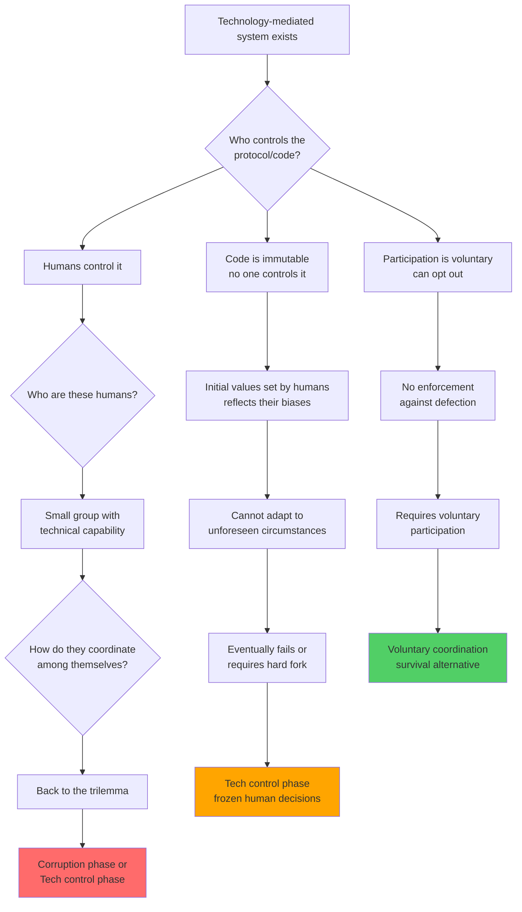
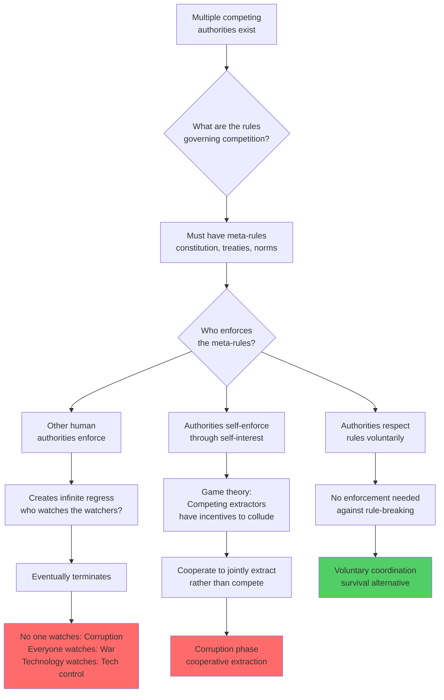
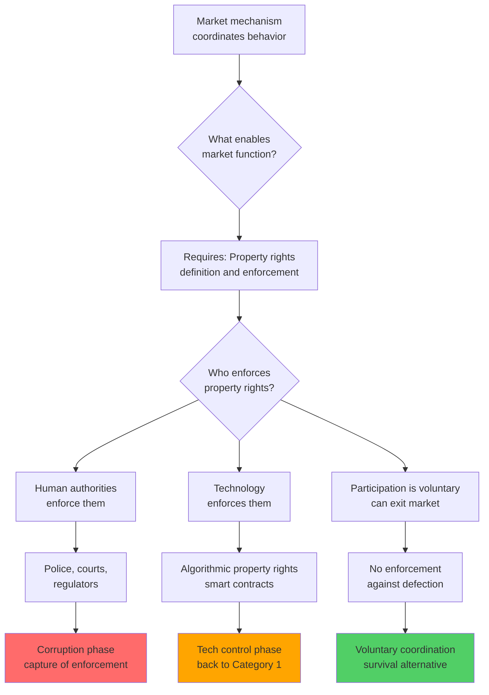
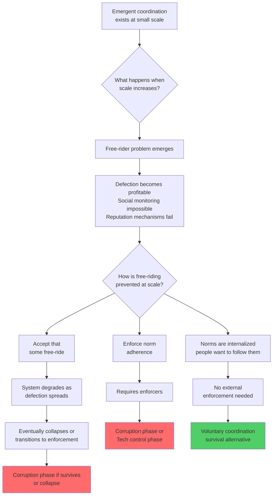
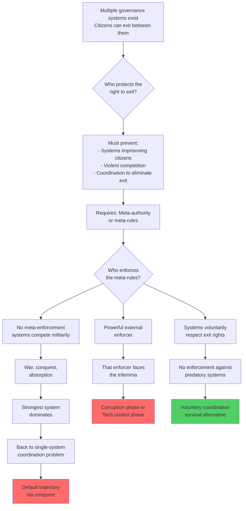
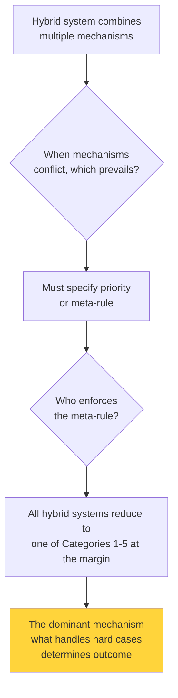

# Appendix A: Why No "Fourth Path" Exists

## The Fundamental Question

Any proposed coordination system must answer: **How is coordination maintained when incentives to defect exist?**

Every alternative proposal, no matter how novel or complex, must provide a mechanism for handling defection at scale. When we trace these mechanisms through, they all reduce to one of a few meta-categories. And each meta-category leads inevitably back to either the default trajectory or voluntary coordination.

## The Meta-Categories

Any "fourth path" proposal must fall into one of these categories:

### Category 1: Technology-Mediated Coordination

**Examples:** Blockchain, DAOs, cryptographic governance, algorithmic enforcement, smart contracts

**The proposal:** Technology can enforce coordination rules without human discretion, eliminating both corruption and the need for value transformation.

**Why it's compelling:** 
- Code is deterministic and uncorruptible
- Cryptography provides mathematical guarantees
- Decentralization removes single points of failure
- Already working at scale (Bitcoin, Ethereum)

**The logical trace:**

**Conclusion:** Technology-mediated coordination either requires human controllers (entering corruption phase), enforces immutable rules (tech control phase), or relies on voluntary participation (survival alternative). There is no fourth option.

**Common objections addressed:**

*"But DAOs are decentralized!"*
→ Governance token holders control decisions. Who controls the tokens? Either widely distributed (requires voluntary participation) or concentrated (small group control = corruption phase).

*"But the protocol is transparent and verifiable!"*
→ Transparency doesn't solve the control problem. Someone still decides protocol upgrades, or the protocol ossifies and fails to adapt.

*"But cryptography is trustless!"*
→ Cryptography guarantees code execution, not that the code serves human interests. Who wrote the code? Who controls the keys? The math is trustless; the system embedding it is not.

---

### Category 2: Distributed Human Authority

**Examples:** Federalism, separation of powers, checks and balances, polycentric governance, competitive governance

**The proposal:** Multiple competing power centers check each other, preventing any single authority from becoming corrupt. Competition disciplines better than centralization.

**Why it's compelling:**
- Historical examples (US Constitution, Swiss cantons)
- Apparent stability over centuries
- Intuitive - competition improves outcomes in markets
- Avoids concentration of power

**The logical trace:**

**Conclusion:** Distributed authority either requires enforcement of the meta-rules (corruption phase or tech control), collapses into collusion (corruption phase), or relies on voluntary adherence (survival alternative).

**Common objections addressed:**

*"But separation of powers has worked for centuries!"*
→ "Worked" is relative. Regulatory capture, legislative-executive collusion, and judicial politicization show the system drifting toward corruption phase. The question is whether it's stable long-term, not whether it can persist for a while.

*"But competition prevents monopoly!"*
→ Cartel theory shows competing powers tend toward coordination when it's profitable. Look at bipartisan consensus on surveillance expansion, military spending, and bank bailouts. Competition is theater; cooperation on extraction is reality.

*"But citizens can check authority through elections!"*
→ Voter influence requires information and organization. Authorities control both through media capture and complexity. Even if citizens could check authority, who enforces the election results? Back to the enforcement question.

---

### Category 3: Economic/Market Mechanisms

**Examples:** Market coordination, price signals, prediction markets, futarchy, incentive alignment

**The proposal:** Economic incentives can coordinate behavior without central authority. Markets discover truth through prices, allocate resources efficiently, and punish bad actors through competition.

**Why it's compelling:**
- Hayek's knowledge problem - markets aggregate distributed information
- Demonstrably effective at coordination (supply chains, etc.)
- No central planner needed
- Self-correcting through feedback

**The logical trace:**

**Conclusion:** Markets require property rights enforcement, which requires enforcers. The enforcer question leads back to the same trilemma.

**Common objections addressed:**

*"But markets are emergent, not designed!"*
→ Markets emerge within an enforcement framework. When that framework fails (no property rights), markets collapse into violence. The emergence doesn't eliminate the enforcement question.

*"But self-interest aligns incentives automatically!"*
→ Only when property rights are secure and defection is punished. Who secures rights? Who punishes defection? Back to enforcement.

*"But prediction markets reveal truth objectively!"*
→ They reveal what bettors believe, weighted by willingness to stake money. Still requires someone to enforce bet resolution. Who decides ground truth when participants dispute it?

---

### Category 4: Emergent/Evolutionary Coordination

**Examples:** Social norms, conventions, spontaneous order, cultural evolution, reputation systems

**The proposal:** Coordination can emerge without design through repeated interaction, social learning, and cultural transmission. No explicit enforcement needed - behavior patterns self-stabilize.

**Why it's compelling:**
- Language emerged this way
- Many social norms function without enforcement
- Appears to avoid the coordination problem entirely
- Works in small groups naturally

**The logical trace:**

**Conclusion:** Emergent coordination at small scale doesn't solve the problem at civilization scale. Either enforcement becomes necessary (entering default trajectory), system collapses, or values are internalized (survival alternative).

**Common objections addressed:**

*"But norms have coordinated societies for millennia!"*
→ Small societies with high visibility and accountability. At scale, norm enforcement becomes costly and eventually requires explicit institutions, entering the default trajectory.

*"But reputation systems scale with technology!"*
→ Who controls the reputation system? Who prevents manipulation? Back to the technology-mediated category.

*"But evolution selects for cooperation!"*
→ Evolutionary timeframes are millions of years. We're asking about coordination over decades. Plus, evolution doesn't optimize for human flourishing - it optimizes for reproductive fitness.

---

### Category 5: Exit Rights / Competitive Governance

**Examples:** Seasteading, network states, charter cities, competitive jurisdiction shopping, voting with your feet

**The proposal:** Instead of fixing coordination within a single system, enable exit. Let people choose their governance system. Competition among systems improves all of them.

**Why it's compelling:**
- Parallels market competition
- Respects individual choice
- Reduces coordination burden (smaller units)
- Historical precedent (migration, city-states)

**The logical trace:**

**Conclusion:** Exit rights require protection. Either an authority enforces them (entering default trajectory), systems voluntarily respect them (survival alternative), or the option disappears through conquest.

**Common objections addressed:**

*"But historical city-states had competitive governance!"*
→ Until they didn't. Conquest, consolidation, and empire formation show the instability. The few that survived (Switzerland) did so through geographic defensibility and voluntary coordination.

*"But people can vote with their feet!"*
→ Only if receiving systems accept them and originating systems let them leave. Who enforces this? Many historical systems prevented exit (Berlin Wall, exit taxes, passport denial).

*"But digital governance allows frictionless exit!"*
→ Physical presence still matters for most coordination. Digital-only governance is back to Category 1 (technology-mediated).

---

### Category 6: Hybrid/Mixed Systems

**Examples:** Combining markets with regulation, democracy with technocracy, centralization with decentralization, any "best of both worlds" approach

**The proposal:** Don't choose one pure system - combine strengths of multiple approaches to compensate for weaknesses.

**Why it's compelling:**
- Seems pragmatic and realistic
- Most existing systems are hybrid
- Avoids extremes
- Flexibility to adapt

**The logical trace:**

**Conclusion:** Hybrid systems don't escape the trilemma - they just obscure which mechanism actually governs at the margin. When you trace through what happens in edge cases, you find it reduces to one of the other categories.

**Common objections addressed:**

*"But mixed systems have better outcomes than pure ones!"*
→ Better outcomes in what timeframe? Many mixed systems persist longer than pure ones, but they're in transition - slowly resolving toward one of the stable states. The question is where they're headed, not where they are.

*"But pragmatism is better than purity!"*
→ This isn't about purity vs pragmatism. It's about identifying actual equilibria. "Hybrid" isn't a stable state - it's a system in tension, resolving over time.

*"But we need checks and balances!"*
→ That's Category 2 (distributed authority). The same analysis applies.

---

## Summary: The Exhaustive Proof

**Every proposed alternative falls into one of six meta-categories:**
1. Technology-mediated coordination
2. Distributed human authority
3. Economic/market mechanisms
4. Emergent/evolutionary coordination
5. Exit rights / competitive governance
6. Hybrid/mixed systems

**Each meta-category reduces to:**
- Requires human enforcement → Corruption phase of default trajectory
- Requires technological enforcement → Tech control phase of default trajectory
- Requires voluntary adherence → Survival alternative

**Therefore:**
Any coordination system at scale must eventually resolve to one of two outcomes: the default trajectory (extinction) or voluntary coordination (survival). There is no stable third option.

**The proof is exhaustive because:**
1. These six categories cover all logical possibilities for coordination mechanisms
2. Each category's reduction to the binary choice is demonstrated through logical necessity, not empirical observation
3. No proposed alternative escapes this categorization

If you believe a "fourth path" exists, identify which meta-category it falls into, then trace through the logic. You'll find it reduces to one of the two outcomes.

---

## Common Specific Proposals Mapped to Categories

To make this concrete, here's where common proposals fall:

**Category 1 (Technology-mediated):**
- Blockchain governance
- DAOs
- Smart contracts
- Algorithmic governance
- AI coordination systems

**Category 2 (Distributed authority):**
- Federalism
- Separation of powers
- Polycentric governance
- Multi-stakeholder governance
- Subsidiarity

**Category 3 (Economic mechanisms):**
- Market coordination
- Prediction markets
- Futarchy
- Incentive alignment schemes
- Quadratic funding/voting

**Category 4 (Emergent):**
- Social norms
- Reputation systems
- Cultural evolution
- Convention
- Spontaneous order

**Category 5 (Exit rights):**
- Network states
- Charter cities
- Seasteading
- Competitive federalism
- Jurisdictional arbitrage

**Category 6 (Hybrid):**
- Constitutional democracy
- Regulated markets
- Social democracy
- Stakeholder capitalism
- Mixed economies

Each of these, when traced through the relevant category's logic, leads back to the binary choice.
