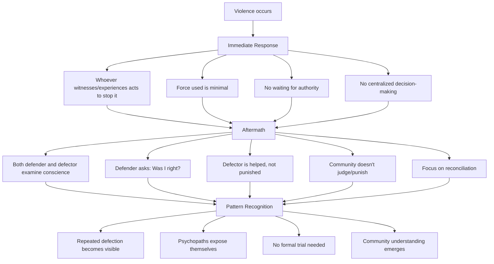
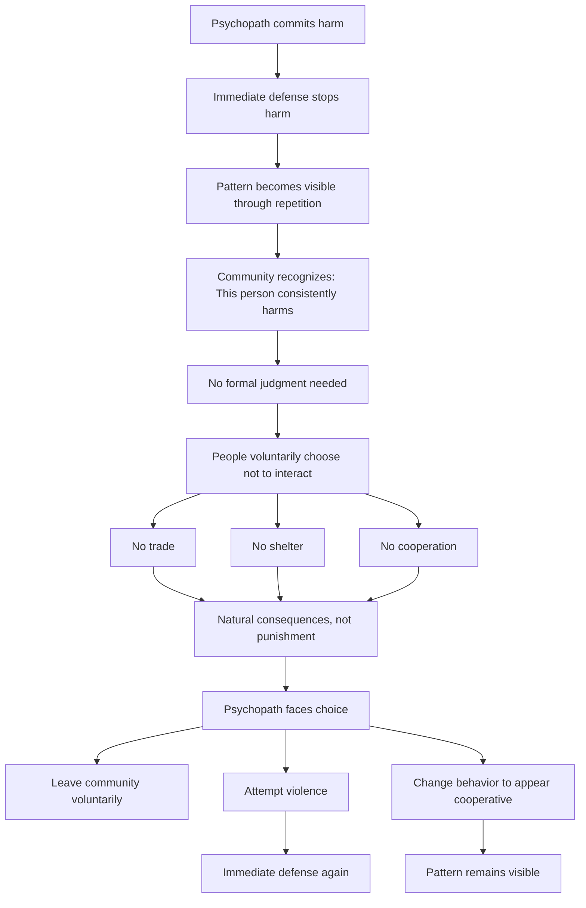
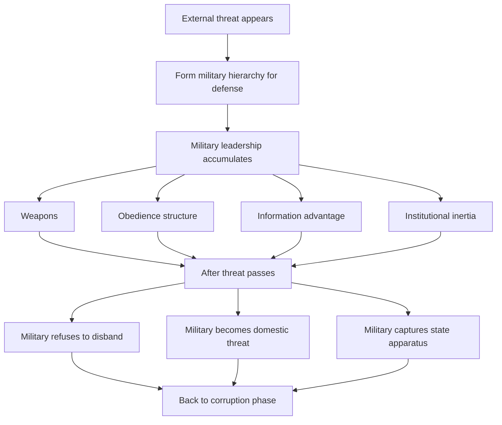
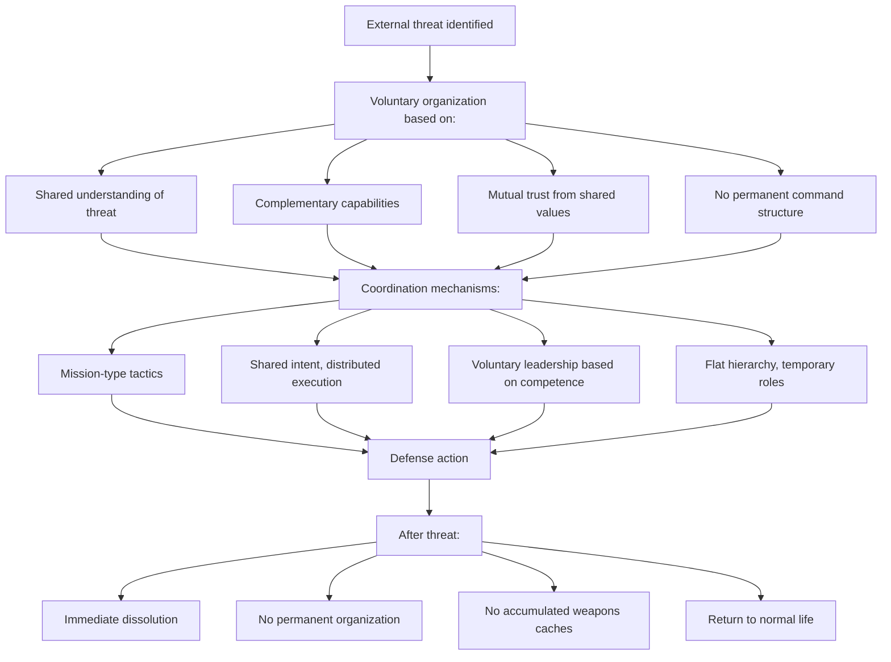

# Appendix B: Defense Mechanisms for Voluntary Coordination

## The Central Challenge

Voluntary coordination faces an existential problem: **How do you handle violence without creating the hierarchical structures that lead back to the default trajectory?**

This breaks into three distinct challenges:
1. **Internal defectors** - psychopaths, opportunists, those who reject universal dignity
2. **External threats** - organized hierarchical societies with military force
3. **The transition problem** - surviving while too small to be viable

This appendix develops frameworks for each. I'll be honest about uncertainty - this is the weakest area theoretically, though there are historical examples that provide evidence.

---

## Part 1: Handling Internal Defectors

### The Problem Precisely Stated

In any population of sufficient size, some percentage will:
- Lack empathy or conscience (psychopaths: ~1-4% of population)
- Opportunistically defect when benefit exceeds expected cost
- Explicitly reject universal dignity and seek to dominate

Without enforcement mechanisms, what prevents these individuals from:
- Using violence to take resources
- Organizing other defectors into predatory groups
- Forcing others into submission through threat

### Why Traditional Solutions Fail

**Option 1: Create enforcement authority**
→ Who enforces? Who watches the enforcers?
→ Authority accumulates power and corrupts
→ Back to corruption phase of default trajectory

**Option 2: Exile/ostracism**
→ Exiled individuals form external threats
→ Creates incentive for false accusation
→ Who decides who gets exiled? (Authority problem)

**Option 3: Punishment/imprisonment**
→ Requires authority to administer
→ Creates incentive structures around punishment
→ Corrupts toward control and extraction

### The Voluntary Coordination Approach

**Principle:** Defense is immediate, minimal, and individual - not systemic.

**Framework:**

**Key differences from enforcement systems:**
- No monopoly on violence - anyone can defend
- No authority accumulation - dissolves after each incident
- No permanent roles (no "police" or "justice system")
- Continuous self-examination prevents defender corruption
- Focuses on present and future, not past punishment

### Why This Might Work: Historical Examples

**Quaker communities (1650s-present):**
- Rejected formal authority structures
- Handled disputes through "clearness committees"
- No punishment, only reconciliation or voluntary departure
- Lasted centuries at village scale
- Failed at larger scales when formal coordination needed

**Early Christian communities (30-300 AD):**
- No formal enforcement mechanisms
- Relied on internal accountability and repentance
- Excommunication was voluntary departure, not forced exile
- Survived persecution and internal disputes
- Corrupted when institutionalized (Constantine onwards)

**Mennonite/Amish communities (1500s-present):**
- Rejection of violence including legal system
- Community accountability without formal authority
- Shunning as last resort (voluntary relationship withdrawal)
- Remarkably low crime rates within community
- Problems handling external threats and internal abuse

**What these examples show:**
- Can work at scales of hundreds to low thousands
- Requires high commitment to shared values
- Fragile to external pressure
- Can handle most internal defection
- Struggles with psychopaths and organized predation

### Game Theory Analysis

**Why don't defectors dominate?**

**Standard Prisoner's Dilemma:**
- Defect dominates cooperate (Nash equilibrium)

**Modified with reputation/immediate response:**
- Defection → Immediate intervention (high cost)
- Defection → Reputation damage (future cost)
- Cooperation → Mutual benefit (ongoing)
- If: Cost of defection > Benefit of defection
- Then: Cooperation becomes Nash equilibrium

**Critical assumptions:**
1. **Visibility:** Defection is observable by community
2. **Immediacy:** Response happens before defector can iterate
3. **Competence:** Defenders are capable of effective intervention
4. **Values alignment:** Most people prefer cooperation and will intervene

**What breaks this:**
- Organized defector groups (visibility fails)
- Defenders who refuse to act (immediacy fails)  
- Defenders less capable than defectors (competence fails)
- Population where defection is normalized (values fail)

### The Psychopath Problem Specifically

**Challenge:** ~1-4% of population lacks empathy. They don't internalize values and can't be rehabilitated through forgiveness.

**Traditional solution:** Imprisonment (requires authority → corruption)

**Voluntary coordination approach:**

**Why this might work:**
- Psychopaths need others to exploit
- Cannot survive without cooperation
- Pattern recognition doesn't require authority
- Voluntary non-interaction is not punishment (no authority needed)

**Critical problems:**
- Requires nearly universal participation (one sympathizer enables psychopath)
- Psychopaths are often charismatic (can manipulate subgroups)
- What if psychopath has valuable skills? Economic pressure to tolerate
- What about children/dependents of psychopath?

**Honest assessment:** This is theoretically possible but practically difficult. Historical communities handled this through strong cultural transmission and geographic isolation. At scale with modern mobility, much harder.

### Scale Thresholds

**Evidence suggests:**
- Works well: 50-500 people (village scale)
- Possible: 500-5,000 people (small town scale)
- Uncertain: 5,000-50,000 people (large town scale)
- Unknown: 50,000+ people (city scale and beyond)

**Why scale matters:**
- Visibility breaks down (can't know everyone)
- Anonymity enables defection without reputation cost
- Organized predation becomes possible
- Value transmission harder across generations

**Possible solutions:**
- Nested communities (coordinate at multiple scales)
- Shared values maintain coordination despite anonymity
- Technology enables visibility (but who controls technology?)

---

## Part 2: External Military Threats

### The Problem Precisely Stated

Voluntary coordination communities face external threat from:
- Hierarchical nation-states with organized militaries
- Predatory groups seeking to conquer/extract
- Ideological adversaries seeking to eliminate alternative systems

**Historical pattern:** Decentralized groups lose to centralized militaries.

**Examples:**
- Native American tribes vs. US military
- Anarchist Catalonia vs. Franco's forces
- Any stateless society vs. organized state expansion

**The challenge:** How to mount effective defense without creating permanent military hierarchy that corrupts into a state?

### Why Traditional Military Organization Fails

**Historical examples:**
- Roman Republic → Empire (military dictatorship)
- Every revolution where military hierarchy persists
- Military coups in dozens of countries

**The pattern is universal:** Standing militaries accumulate power and eventually either rule directly or become kingmakers.

### The Voluntary Coordination Approach

**Principle:** No permanent military hierarchy. Voluntary coordination for defense only while threat exists, dissolution when threat passes.

**Framework:**

**Critical dependencies:**
- People are already armed and trained (no central armory to control)
- Shared values create natural coordination
- Threat is clear enough that voluntary mobilization happens
- Defense capabilities are distributed, not centralized

### Historical Examples That Worked

**Swiss canton system (1291-present):**
- No standing army (until recently)
- Militia system - every adult male armed and trained
- Voluntary coordination among cantons
- Successfully defended against larger powers for 700+ years
- Geographic advantages (mountains) but also institutional design

**American Revolution (1775-1783):**
- Voluntary militias defeated organized British military
- Continental Army was temporary, dissolved after war
- Success came from distributed resistance, not centralized force
- Washington's refusal of kingship was critical
- Rapid demobilization after victory

**Finnish Winter War (1939-1940):**
- Decentralized defense against Soviet invasion
- Small units with local knowledge
- Voluntary coordination under extreme pressure
- Tactical success despite strategic loss
- Demonstrated effectiveness of distributed defense

**Modern insurgencies:**
- Taliban, Viet Cong, etc. demonstrate that distributed forces with deep motivation defeat centralized hierarchies
- Success correlates with genuine value commitment, not just opportunism
- Once victorious, typically centralize and corrupt (demonstrating the risk)

### Why This Approach Can Work

**Advantages of distributed defense:**

1. **Information asymmetry:** Defenders have local knowledge attackers lack
2. **Motivation differential:** Defending home creates stronger commitment than conquest
3. **Resilience:** No central command to decapitate
4. **Adaptability:** Distributed decision-making responds faster
5. **Economic efficiency:** No standing military to fund
6. **Technology force multiplier:** Modern weapons make individuals more effective

**Modern technology amplifies these advantages:**
- Drones (cheap, effective, deployable by individuals)
- Precision weapons (reduce need for massed force)
- Encrypted communication (coordination without central infrastructure)
- 3D printing (distributed weapons manufacturing)
- Asymmetric warfare techniques (documented and teachable)

**Theoretical basis (Lanchester's Laws):**
- Traditional warfare: Force effectiveness scales with square of numbers
- Modern precision warfare: Scales linearly or better
- Advantage to defender with good intelligence and weapons

### Game Theory of Conquest

**Why do states conquer?**

Cost of conquest < Expected value of extraction

**Distributed defense changes this equation:**

- Cost of conquest = Very high (long guerrilla war)
- Expected value of extraction = Low (can't control population)
- Expected cost after conquest = Very high (permanent insurgency)

**Result:** Conquest becomes economically irrational. States don't attack what they can't profitably control.

**Historical validation:**
- Afghanistan ("graveyard of empires")
- Vietnam (US couldn't establish control despite military dominance)
- Finland (Soviets concluded conquest cost exceeded value)

### Critical Vulnerabilities

**Where distributed defense fails:**

1. **Overwhelming force disparity:** Nuclear weapons, airpower supremacy
2. **Genocide strategy:** Attacker willing to annihilate rather than conquer
3. **Internal division:** Community fractures under pressure
4. **Long siege:** Attacker can starve defenders with blockade
5. **Ideological conquest:** Some defend values, others defect

**Honest assessment:** Distributed defense can resist conventional conquest by rational actors. Against overwhelming technological superiority or exterminationist ideology, it may fail.

### The Transition Problem

**Challenge:** Small voluntary coordination communities don't initially have numbers for effective distributed defense.

**How do they survive while small?**

**Strategy 1: Geographic selection**
- Mountains, islands, other defensible terrain
- Reduces attacker advantage without needing numbers
- Historical examples: Swiss, Corsicans, mountain peoples globally
- Limitation: Requires such terrain to be available

**Strategy 2: Not worth conquering (temporarily)**
- Appear weak/poor until reaching viable scale
- Don't visibly challenge existing powers
- Grow within existing systems until distributed
- Risk: Can be eliminated early if threat is recognized

**Strategy 3: Multiple simultaneous communities**
- Emerge in many places at once
- Too distributed to suppress centrally
- Some survive even if others fall
- Requires coordination at founding phase

**Strategy 4: Grow within existing systems**
- Live voluntary coordination principles inside corruption phase societies
- Build trust networks and demonstrate viability
- By the time visible as alternative, too distributed to suppress
- Velvet revolution / color revolution pattern

**Likely reality:** Combination of all four strategies required.

---

## Part 3: Scale Thresholds and Viability

### The Minimum Viable Community

**Question:** What's the minimum population needed for voluntary coordination to be viable against both internal and external threats?

**Factors:**
- Defense capability (enough people to resist external threats)
- Economic viability (enough specialization for modern life)
- Genetic diversity (avoid inbreeding)
- Cultural transmission (enough young people to sustain values)

**Rough estimates:**

**Minimum for survival: 500-1,000 people**
- Can mount defense
- Limited specialization
- Genetic diversity marginal
- Cultural transmission possible

**Minimum for viability: 5,000-10,000 people**
- Effective distributed defense
- Significant specialization
- Genetic diversity sufficient
- Robust cultural transmission

**Minimum for independence: 50,000-100,000 people**
- Can resist medium-scale military
- Full economic independence possible
- Complete genetic diversity
- Multiple generations of cultural transmission

**These are estimates based on:**
- Historical examples (Swiss cantons, Iceland, small nations)
- Genetic diversity research (minimum viable population)
- Military analysis (effective resistance requires numbers)
- Economic specialization requirements

**Major uncertainty:** Modern technology may change these thresholds (communication, weapons, manufacturing). Could be lower or higher.

### Scaling Beyond Initial Communities

**Challenge:** How do communities coordinate with each other without creating super-community hierarchy?

**Approaches:**

**1. Voluntary confederation:**
- Each community remains sovereign
- Coordinate on shared threats voluntarily
- No permanent super-structure
- Example: Original Swiss confederation

**2. Shared values/culture:**
- Same principles across communities
- Natural coordination without formal structure
- Like religion coordinating without central authority
- Example: Early Christianity, Islam (before caliphate)

**3. Network coordination:**
- Many-to-many relationships, not hub-and-spoke
- Information sharing without authority
- Joint action when interests align
- Example: Open source software development

**Critical question:** Can these scale to millions/billions?

**Honest answer:** Unknown. No historical example at that scale without hierarchy emerging.

**Possible mechanism:** Technology enables coordination at scales impossible historically. Internet, encryption, distributed systems might change the scaling limits. But this is speculative.

---

## Part 4: What Remains Uncertain

I need to be honest about the limits of this analysis:

### Known Unknowns

1. **Scale limits:** Don't know if voluntary coordination can reach civilization scale (billions)

2. **Psychopath handling:** Theory suggests it works; practice at scale is unproven

3. **Modern weapons:** Nuclear weapons, drones, AI might break the distributed defense model

4. **Value transmission:** Can shared values persist across generations at scale?

5. **Transition mechanics:** How exactly does a community grow from 100 to 100,000 without being crushed?

6. **Organizational memory:** How do communities remember lessons without formal institutions?

### Unknown Unknowns

What problems haven't we even conceived of? Historical examples are limited to pre-modern technology and small scales. Extrapolating to global scale with AI, biotech, nanotech, etc. is speculative.

### Why Try Anyway?

**The asymmetry of outcomes:**
- Default trajectory: Certain extinction or permanent enslavement
- Voluntary coordination: Uncertain success but only viable alternative

**When certain death is the alternative, you attempt the uncertain option.**

Historical examples provide existence proofs at small scale. Theory suggests it could work at larger scale. The mechanisms make logical sense.

But claiming certainty would be dishonest. This is the riskiest part of the framework, the place where faith/hope/commitment matter most.

---

## Summary: Defense Framework

**For internal defectors:**
- Immediate, minimal, individual defense
- No permanent authority structures
- Pattern recognition through repeated observation
- Voluntary disassociation from persistent bad actors
- Continuous repentance and accountability for defenders

**For external threats:**
- Distributed defense with voluntary coordination
- No standing military hierarchy
- Immediate dissolution after threat passes
- Geographic selection and not-worth-conquering during growth
- Technology as force multiplier for individuals

**For scale:**
- Start small (500-1,000 minimum)
- Grow to viable (5,000-10,000)
- Coordinate between communities voluntarily
- Uncertain how/if this reaches billions

**Critical dependencies:**
- Shared values genuinely held by most people
- Competence and capability distributed throughout population
- Willingness to act (defend others, coordinate under pressure)
- Technology that enables coordination without hierarchy

**Honest assessment:** 
This is the weakest part of the framework logically. Historical examples exist at small scale. Theory suggests viability at larger scale. But claiming certainty would be intellectual dishonesty.

The case for attempting it: Default trajectory leads to certain extinction. This is uncertain but the only viable alternative. When the alternative is certain death, you take the uncertain option.
