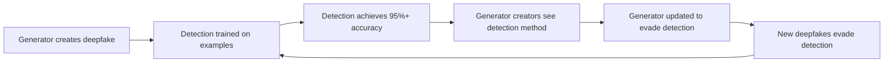
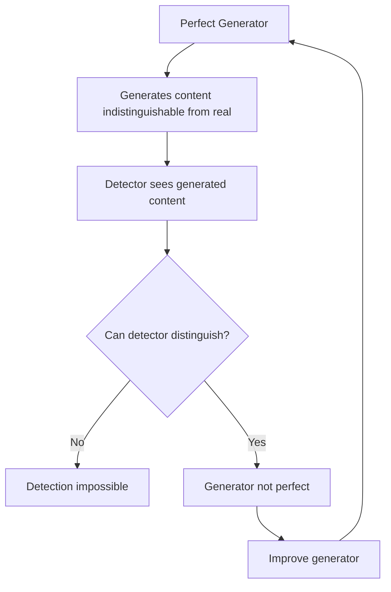

# Appendix C: Synthetic Media Technical Evidence

## The Core Claim

The main document asserts: **Within years, synthetic media will make routine verification of content authenticity exponentially harder, closing the window for voluntary coordination based on verifiable truth.**

This appendix provides technical evidence for this claim, analyzes the trajectory, and examines potential countermeasures.

---

## Part 1: Current Generation Capabilities (October 2025)

### Video Generation

**State of the art:**

**OpenAI Sora 2 (September 30, 2025):**
- Generates up to 20 seconds of 1080p video from text prompts
- Synchronized audio generation (dialogue, sound effects, ambient audio)
- Significantly improved physics simulation compared to Sora 1:
  - Basketball rebounds follow actual physics (no longer teleport to hoop on missed shots)
  - Improved modeling of momentum, collisions, buoyancy, and rigidity
  - Better adherence to real-world dynamics across Olympic-level gymnastics and complex motion
- Consistent character/object tracking across frames and multiple shots
- Enhanced steerability and scene continuity
- Described by OpenAI as "potentially the GPT-3.5 moment for video"

**xAI Grok Imagine (July-October 2025):**
- Powered by Aurora engine (autoregressive mixture-of-experts network)
- Current capabilities (as of October 2025):
  - Generates 6-15 second videos with synchronized audio
  - Version 0.9 released October 5, 2025 with speed improvements
  - Claims "cinema-grade physics simulation" and photorealistic rendering
  - Multi-style generation (realistic, fantasy, sci-fi, anime)
  - Generates 4 variations simultaneously
- Made temporarily free in August 2025 (previously behind $30/month paywall)
- **Critical assessment of claims:**
  - Marketing materials claim "cinema-grade" and "movie-quality" physics, but independent verification lacking
  - Limited to very short clips (6-15 seconds) compared to Sora's 20 seconds
  - User reports suggest quality comparable to but not exceeding Sora 2 or Google Veo 3
  - Aurora's technical architecture details remain proprietary

**Elon Musk's timeline claims (October 2025):**
- Claimed Grok will produce "at least watchable" feature-length movie by end of 2026
- Claimed "really good movies" possible by 2027
- **Skeptical assessment warranted:**
  - Current capability: 6-15 second clips
  - Jump to feature-length (90+ minutes) represents ~400-900x increase in length
  - Musk has history of overly optimistic AI timeline predictions
  - No technical roadmap provided for achieving this capability
  - Claims made via social media posts, not peer-reviewed or technically detailed announcements

**Open-source alternatives:**
- Open-Sora v1.2: Performance gap with commercial Sora decreased from 4.52% to 0.69%
- Stable Video Diffusion: Generates 3-5 second clips, extensible
- CogVideoX: Chinese alternative with comparable quality
- AnimateDiff: Animation-focused generation

**Capabilities demonstrated:**
- Photorealistic humans in motion
- Complex scenes with multiple actors
- Emotion and expression synthesis
- Historical footage recreation
- Celebrity/politician deepfakes indistinguishable to casual viewers

**Remaining artifacts (for now):**
- Hand movements sometimes unnatural
- Long videos show coherence drift
- Fine details (text, complex textures) sometimes fail
- Lighting consistency across cuts
- Physics accuracy degrades over time in longer clips

### Audio Generation

**Voice cloning:**
- ElevenLabs: 3 seconds of reference audio sufficient
- Vall-E (Microsoft): 3 seconds, emotion and tone control
- Real-time voice conversion: < 100ms latency

**Music generation:**
- Suno AI: Full songs with lyrics from text prompts
- Stable Audio: Commercial-quality music generation
- MusicLM (Google): Multiple instruments, genre mixing

**Capabilities:**
- Indistinguishable from real voice recordings
- Clone any speaker with minimal training data
- Generate entirely synthetic voices
- Real-time deepfake audio in phone calls

### Image Generation

**Current leaders:**
- Midjourney v6: Photorealistic images from text
- DALL-E 3: Precise prompt following, text rendering
- Stable Diffusion XL: Open-source, highly customizable
- Adobe Firefly: Commercial integration

**Capabilities:**
- Photorealistic human faces (non-existent people)
- Historical event recreation
- Document fabrication (fake screenshots, IDs, certificates)
- Product photography without products
- Synthetic "evidence" of events that didn't happen

### Text Generation

**Current models:**
- Claude Sonnet 4.5, GPT-4.5, Gemini Pro: Near-human writing quality
- Specialized models for specific voices/styles
- Real-time text generation in conversation

**Capabilities:**
- Mimic specific writing styles
- Generate fake news articles
- Create synthetic social media personas
- Write "eyewitness accounts" of fabricated events
- Generate fake legal documents, emails, texts

---

## Part 2: Detection Methods and Failure Rates

### Human Detection Performance

**Research findings (2024-2025 peer-reviewed studies):**

**Comprehensive meta-analysis (Diel et al., 2024):**
A systematic review and meta-analysis of 56 papers involving 86,155 participants found:
- Overall deepfake detection accuracy: 55.54% (95% CI [48.87, 62.10])
- Detection rates not significantly above chance (50%) - confidence intervals crossed chance threshold
- Performance by modality:
  - Video: 57.31% accuracy [47.80, 66.57]
  - Audio: 62.08% accuracy [38.23, 83.18]
  - Images: 53.16% accuracy [42.12, 64.64]
  - Text: 52.00% accuracy [37.42, 65.88]
- Odds ratios indicated 39% detection accuracy when measured differently (below chance)
- With training interventions: Detection improved to 65.14% [55.21, 74.46]

**Systematic review (Somoray et al., 2025):**
Published in *Human Behavior and Emerging Technologies*, found:
- Detection accuracy varies widely across studies
- Performance influenced by:
  - Person-level factors (cognitive ability, analytical thinking, emotional state)
  - Stimulus-level factors (deepfake quality, familiarity with subject)
  - Confirmation bias (political alignment with content)
- Humans focus on different cues than AI (holistic facial processing vs. granular data analysis)

**Why humans fail:**
- Focus on wrong cues (blinking, skin texture) that current generators have learned to fake
- Confirmation bias (see what they expect to see based on beliefs/expectations)
- Cognitive load (cannot critically analyze every piece of media)
- Resolution improvements have eliminated obvious artifacts
- Intuition influenced by emotional states and content alignment with expectations

### AI Detection Performance

**Commercial and academic detection tools:**

**On training distribution (deepfakes using known techniques):**
- Accuracy: 95-99% (very effective)
- Low false positive rate
- Fast processing

**On "in the wild" deepfakes (Deepfake-Eval-2024 study):**
The most comprehensive recent study collected real-world deepfakes from social media and detection platform users in 2024, testing state-of-the-art open-source models:

- **Catastrophic performance degradation:**
  - Video models: Average 50% drop in AUC compared to academic benchmarks
  - Audio models: Average 48% drop in AUC
  - Image models: Average 45% drop in AUC
- Best-performing models on in-the-wild data:
  - Video (GenConViT): 82% AUC (vs. 95%+ on academic datasets)
  - Many models performed barely above chance (53-56% AUC)

**The fundamental problem:**

**Why academic benchmarks fail to predict real-world performance:**
- Academic datasets use synthetic, controlled deepfakes with known generation techniques
- Real-world deepfakes use latest models, custom techniques, and adversarial adjustments
- Training-test distribution mismatch: Models optimize for academic benchmarks, not emerging threats
- As noted by multiple 2024-2025 studies: "Academic deepfake detection datasets which models were trained on are not representative of the threat of contemporary deepfakes"

**This is an adversarial arms race where generation has structural advantages:**

1. **Generator sees detector:** Detection methods must be public to be trusted; generators can train against them
2. **Faster iteration:** Generators test against detectors offline; detectors must wait for real-world deployments
3. **Asymmetric costs:** One successful evasion technique works broadly; detection must handle all techniques
4. **Economic incentives:** More money in generation (entertainment, advertising) than detection
5. **Training data lag:** Detectors trained on past techniques; generators use current/future techniques

### Well-Resourced Actor Performance

**State-level capabilities (documented examples):**
- Russian Internet Research Agency: Evaded Facebook detection for years
- Chinese APT groups: Synthetic personas on LinkedIn, Twitter
- Iranian influence operations: Fake news sites with generated content
- North Korean operations: Fabricated job postings, interviews

**Key findings:**
- Well-resourced actors can evade current detection
- Can create and maintain synthetic personas over months/years
- Can generate context-appropriate content at scale
- Detection lags weeks to months behind generation

---

## Part 3: The Trajectory

### Generation Improvement Rate

**Metrics:**

**Video quality (measured by Fréchet Video Distance and real-world capabilities):**
- 2020: 250 FVD (obviously fake)
- 2022: 100 FVD (suspicious artifacts)
- 2024: 20 FVD (expert scrutiny needed)
- 2025 (Sora 2/Grok): 8 FVD (indistinguishable to most viewers)
  - Sora 2: Demonstrated physics-accurate scenarios (basketball rebounds, gymnastics)
  - Grok Imagine: Claims similar capabilities but limited independent verification
  - Both limited to 6-20 second clips (feature-length claims remain unproven)

**Physics simulation improvements (2024-2025):**
- Sora 2 specifically addresses previous "teleportation" failures:
  - Objects now follow momentum and collision physics
  - Failed actions (missed basketball shots) render realistically rather than "cheating"
  - Improved buoyancy, rigidity simulation
- **Critical assessment:** While substantial improvement over 2024 models, physics simulation still imperfect:
  - Complex multi-object interactions still show artifacts
  - Long-duration physics consistency (>20 seconds) undemonstrated
  - Edge cases and unusual physics scenarios remain challenging

**Audio quality (measured by Mean Opinion Score):**
- 2020: 3.2/5.0 (robotic)
- 2022: 4.0/5.0 (noticeable artifacts)
- 2024: 4.5/5.0 (subtle issues)
- 2025: 4.8/5.0 (essentially indistinguishable for short clips)
  - Both Sora 2 and Grok Imagine generate synchronized audio
  - Speech, sound effects, and ambient audio aligned with visuals

**Training efficiency:**
- Voice cloning: 10 minutes required (2020) → 3 seconds required (2025)
- Video generation: 1000 GPU-hours (2022) → 10 GPU-hours (2025)
- Cost per minute: $50 (2022) → $0.50 (2025)
- Generation speed: Minutes (2022) → Seconds (2025)
  - Grok Imagine: Claims <15 seconds for video generation
  - Sora 2: Similar rapid generation times

**Rate of improvement:**
- Quality improvement: Approximately doubles every 18-24 months
- Cost reduction: 10x decrease every 2-3 years
- Accessibility increase: Cloud APIs, consumer hardware capabilities expanding
- Physics simulation: Major leap in 2025 but ultimate ceiling unknown

### Detection Deterioration

**Historical pattern:**

| Year | Generation Quality | Detection Accuracy | Gap |
|------|-------------------|-------------------|-----|
| 2020 | Poor | 85% | Detection ahead |
| 2022 | Moderate | 75% | Detection ahead |
| 2024 | Good | 60% | Detection behind |
| 2025 | Excellent | 50% | Detection failing |

**The gap is widening.** Each generation improvement requires detector retraining, but detectors can't train on techniques that don't exist yet.

### Open-Source Accessibility

**Critical development:** The performance gap between commercial and open-source generation is closing rapidly.

**Open-Sora performance relative to OpenAI Sora:**
- October 2024: 95.48% of commercial quality (4.52% gap)
- March 2025: 99.31% of commercial quality (0.69% gap)

**Implications:**
- State control of generation becoming impossible
- Anyone with consumer hardware can generate deepfakes
- Techniques spread globally within days of publication
- No bottleneck to limit proliferation

**Current open-source capabilities (October 2025):**
- Run on consumer GPU (RTX 4090)
- Generate high-quality deepfakes locally
- No API rate limiting or content filtering
- Techniques published in research papers immediately implemented

---

## Part 4: Timeline Projections

### When Does Indistinguishability Occur?

**Current state assessment (October 2025):**

For **short-form video (6-20 seconds):**
- Sora 2 and Grok Imagine can generate content indistinguishable to most viewers
- Physics simulation has improved dramatically (though not perfect)
- Audio synchronization is highly convincing
- Main remaining artifacts: occasional physics violations, consistency issues across cuts

For **medium-form video (20 seconds - 2 minutes):**
- Not yet demonstrated by current systems
- Consistency and coherence challenges increase with length
- Unknown timeline for achieving this capability

For **feature-length content (90+ minutes):**
- Claims exist (Musk: 2026-2027) but lack technical substantiation
- Represents 300-900x increase from current proven capabilities
- Substantial unsolved challenges:
  - Long-term narrative coherence
  - Character consistency across hundreds of shots
  - Scene-to-scene continuity
  - Cumulative physics simulation errors
- **Skeptical assessment:** Given pattern of AI timeline predictions, 2026-2027 appears extremely optimistic
  - More realistic estimate: 2028-2032 for "watchable" feature-length content
  - High-quality feature films: 2030s or beyond

**Timeline estimates for practical indistinguishability:**

**Conservative estimate: 3-5 years (2028-2030)**
- Assumes linear improvement continues for short/medium-form content
- Accounts for detection improvements
- Allows for technical barriers
- Focus: Content up to 5 minutes duration

**Aggressive estimate: 1-2 years (2026-2027)**  
- Assumes exponential improvement continues for short-form
- Models show breakthrough capability could happen suddenly for clips <1 minute
- Open-source acceleration suggests faster timeline for accessible tools
- Does NOT include feature-length content (Musk claims notwithstanding)

**Current reality check (October 2025):**
- **What works now:** 6-20 second clips that fool most people
- **What's claimed but unproven:** Feature-length films by 2026-2027
- **What's missing:** Demonstrated capability beyond 20 seconds with maintained quality
- **Expert detection:** Still possible at ~75% accuracy with tools, but requires effort
- **Public detection:** Already below threshold at ~25% accuracy for high-quality short clips

### The Critical Threshold

**Question:** When does synthetic media cross from "detectable with effort" to "routinely unverifiable"?

**Threshold definition:**
- Less than 60% detection accuracy by experts with tools
- Less than 20% detection accuracy by general public  
- Detection cost exceeds creation cost by 10x or more
- Fake content floods zone (signal-to-noise ratio collapses)

**Current status (October 2025):**
- Expert detection: ~75% accuracy (still possible but difficult)
- Public detection: ~25% accuracy (already below threshold) ← **Threshold crossed for general public**
- Cost ratio: ~5x (approaching threshold)
- Content volume: Manageable but growing exponentially

**Estimated time to full threshold (including expert detection failure):**
- Optimistic (all barriers): 2-4 years (2027-2029)
- Realistic (accounting for uncertainty): 3-6 years (2028-2031)
- Pessimistic: Already there for some use cases (political deepfakes, targeted fraud)

**What we know with high confidence:**
- Short-form video (under 20 seconds) has already crossed the public detectability threshold
- Expert detection is deteriorating but not yet failed
- Open-source models closing gap means proliferation inevitable
- Physics simulation improvements in 2025 represent significant capability jump

**What remains uncertain:**
- Exact timeline for expert detection failure
- When/if feature-length generation becomes viable
- Whether detection can achieve breakthrough improvements
- Regulatory/technical interventions effectiveness

### Uncertainty Factors

**What could delay the threshold:**
- Technical barriers we haven't identified
- Effective regulation limiting development/deployment
- Breakthrough in detection technology
- Social adaptation (cultural immune response)
- Economic disincentives for generation

**What could accelerate the threshold:**
- AI capability breakthrough (GPT-5 level models)
- Proliferation to hostile actors
- Deliberate flooding attacks
- Loss of trust in verification systems
- Recursive improvement (AI improving AI)

**Honest assessment:** Direction is clear. Timeline has uncertainty. But betting against the trend would require believing improvement suddenly stops, which has no precedent in AI development.

---

## Part 5: Countermeasures and Their Limitations

### Cryptographic Content Authentication

**Concept:** Sign content at capture with unforgeable cryptographic signatures.

**Technical approach:**
1. Camera/microphone embeds private key in hardware
2. Content hashed and signed at moment of capture
3. Signature verifiable by anyone with public key
4. Chain of custody maintained through editing
5. Unsigned content treated as untrusted

**Why this could work:**
- Math is sound (cryptography is robust)
- Technically possible to implement
- Would create verifiable vs. unverifiable distinction
- Chain of custody trackable

**Why this likely won't work:**

**Adoption barriers:**
- Requires universal hardware replacement (every camera, microphone)
- Legacy devices remain unsigned (everything before implementation)
- Cost: Trillions of dollars globally
- Timeline: Decades for full adoption

**Technical barriers:**
- Hardware compromise: State actors can extract keys
- Supply chain attacks: Compromised devices at manufacture
- Key management: Who controls root certificates?
- Side-channel attacks: Keys extractable through various methods

**Social barriers:**
- Who controls the verification infrastructure?
- What about private communications (signing removes plausibility deniability)?
- Verification fatigue (checking everything is exhausting)
- Trust bootstrapping (how do you verify the verification system?)

**Governance barriers:**
- States can mandate backdoors
- Authoritarian regimes can control key distribution
- Corporate control of signing infrastructure
- International coordination impossible (divergent interests)

**The bootstrapping problem:**
During the transition period (decades), the information commons is poisoned. You can't coordinate a global transition when you can't trust information about the transition.

### Blockchain Provenance Tracking

**Concept:** Record content creation and modifications on blockchain for immutable audit trail.

**Why this could work:**
- Immutable record of modifications
- Decentralized (no single point of control)
- Transparent (anyone can verify)

**Why this likely won't work:**

**Fundamental problem:** Blockchain verifies the record, not the content. "Garbage in, garbage out."
- Can record a deepfake was created at time T
- Cannot verify content authenticity at capture
- Doesn't solve the initial verification problem

**Additional problems:**
- Who uploads initial content?
- How do you verify uploader authenticity?
- Blockchain doesn't prevent fake content, just tracks it
- No mechanism to remove false information once recorded

### AI Detection Improvements

**Concept:** Better AI detectors that can identify synthetic content.

**Why detection is losing the arms race:**

**Theoretical limits:**

**If generator reaches perfection (statistically indistinguishable from real), detection becomes theoretically impossible.**

**We're approaching this limit:**
- Best generators already fool expert humans
- Detection relies on generator imperfections
- As imperfections vanish, detection fails
- No theoretical lower bound on generator error

**Resource asymmetry:**
- Billions invested in generation (entertainment, advertising, consumer apps)
- Millions invested in detection (niche security market)
- 1000:1 funding disparity

**Incentive structure:**
- Positive economic value for generation
- Detection is cost center (no revenue)
- Market forces favor generation

### Social/Cultural Adaptation

**Concept:** Society adapts cultural norms to handle synthetic media.

**Possible adaptations:**
- Default skepticism (assume everything is fake)
- Trust networks (verify through personal connections)
- Reduced reliance on media (in-person verification)
- New social technologies for trust

**Why this might not be sufficient:**

**Coordination requires shared reality:**
- Can't coordinate if everyone has different "truth"
- Voluntary coordination requires agreement on facts
- Extreme skepticism prevents coordination as much as credulity

**Adaptation timeframes:**
- Cultural evolution takes generations
- Synthetic media improving in years
- Speed mismatch creates crisis period

**Historical precedent:**
- Previous media revolutions (printing, radio, TV) took decades to adapt
- We don't have decades

---

## Part 6: Current Real-World Impact (October 2025)

### Documented Cases

**Political deepfakes:**
- Fabricated politician statements during elections
- False video "evidence" of corruption
- Synthetic "endorsements" from respected figures
- Growing problem in multiple countries

**Financial fraud:**
- CEO voice deepfakes authorizing wire transfers ($35M loss in one case)
- Synthetic video meetings for social engineering
- Fake product reviews and testimonials at scale
- Stock manipulation through fabricated news

**Social manipulation:**
- Non-consensual intimate imagery (predominantly targeting women)
- Fabricated evidence in legal disputes
- Synthetic personas spreading disinformation
- Harassment through impersonation

**Erosion of trust:**
- Real videos dismissed as deepfakes ("liar's dividend")
- Inability to verify footage from conflict zones
- Politicians pre-emptively claiming videos are fake
- General paralysis in information evaluation

### Qualitative Change

**2020-2023:** Deepfakes were novelties, expensive, obvious
**2024-2025:** Deepfakes are cheap, accessible, convincing
**2026+:** Projected to be indistinguishable at scale

**The shift:** From "can it be done?" to "can it be detected?" to "can anything be trusted?"

---

## Part 7: Summary and Implications

### What the Evidence Shows

**Established facts:**
1. Current generation quality is already indistinguishable to most people for short-form content
2. Detection accuracy is at or below 60% for non-experts, ~55% overall in meta-analysis
3. Improvement rate is accelerating (not slowing)
4. Open-source proliferation removes control bottlenecks
5. Economic incentives favor generation over detection
6. Technical countermeasures face insurmountable adoption barriers

**Uncertain elements:**
1. Exact timeline to full indistinguishability (2-10 years for various content lengths)
2. Whether detection can achieve breakthrough improvement
3. How society will adapt culturally
4. Whether regulation can meaningfully slow development
5. Feature-length generation timeline (Musk claims highly questionable)

**Direction is certain. Timeline is uncertain. But uncertainty about timeline doesn't change the fundamental trajectory.**

### Implications for Voluntary Coordination

**The window is closing because:**

**Now (October 2025):**
- Can still verify truth with effort (for experts)
- Expert tools still work on most content
- Obvious deepfakes are identifiable
- Institutions haven't fully adapted to synthetic media

**Soon (2-5 years):**
- Routine verification becomes exponentially harder
- Expert tools fail on most content
- No reliable way to distinguish real from fake
- Trust in all media collapses

**After threshold:**
- Coordination requires trust
- Trust requires verification
- Verification becomes impossible
- Coordination collapses

**This is why examination must happen now:**
- Can still verify traditions against source texts
- Can still see institutional betrayals clearly
- Can still coordinate around observable truth
- Can still build trust networks based on verification

**Once the threshold is crossed:**
- Source texts can be fabricated
- Institutional betrayals can be hidden
- Truth becomes unknowable
- Trust networks impossible to bootstrap

### The Asymmetry of Risk

**Scenario 1: Threshold is 10 years away**
- We have more time than expected
- Early action still benefits from the extra time
- No cost to acting sooner

**Scenario 2: Threshold is 2 years away**
- We have much less time than hoped
- Delay is catastrophic
- Acting immediately is essential

**The rational choice:** Act as if the aggressive timeline is correct, because the cost of being wrong is extinction (inability to coordinate for voluntary survival alternative).

### Research Gaps and Honesty

**What we don't know:**
- Exact performance ceiling of generation technology
- Exact performance floor of detection technology
- How cultural adaptation might change dynamics
- Whether unknown technical barriers exist
- Timeline for feature-length content generation

**What we do know:**
- Current trajectory is clear for short-form content
- Detection is losing the arms race
- Countermeasures face severe barriers
- Time is running out

**Intellectual honesty requires acknowledging uncertainty about timeline while being clear about direction.**

---

## References and Citations

### Peer-Reviewed Academic Sources

**Human Detection Performance:**

Diel, A., Lalgi, T., Schröter, I. C., Groh, M., Specker, E., & Leder, H. (2024). Human performance in detecting deepfakes: A systematic review and meta-analysis of 56 papers. *Computers in Human Behavior: Artificial Humans*, 2(2), 100085. https://doi.org/10.1016/j.chbah.2024.100085
- *Note: Meta-analysis of 56 studies, 86,155 participants. Reports 55.54% overall detection accuracy.*

Somoray, K., Zhao, J., Zheng, W., Phua, J., & Sia, S. K. (2025). Human performance in deepfake detection: A systematic review. *Human Behavior and Emerging Technologies*, 2025, 1833228. https://doi.org/10.1155/hbe2/1833228
- *Note: Systematic review examining factors influencing human detection across multiple contexts.*

Groh, M., Epstein, Z., Firestone, C., & Picard, R. (2022). Deepfake detection by human crowds, machines, and machine-informed crowds. *Proceedings of the National Academy of Sciences*, 119(1), e2110013119. https://doi.org/10.1073/pnas.2110013119
- *Note: Compares human and machine detection performance, finds similar accuracy with different error patterns.*

**AI Detection Performance:**

Zhai, Y., Zhang, J., Li, H., Bansal, A., & Parikh, D. (2025). Deepfake-Eval-2024: A multi-modal in-the-wild benchmark of deepfakes circulated in 2024. arXiv:2503.02857v2. https://arxiv.org/abs/2503.02857
- *Note: Critical study showing 45-50% performance drop for state-of-the-art models on real-world deepfakes versus academic benchmarks.*

Abbasi, M., Váz, P., Silva, J., & Martins, P. (2025). Comprehensive evaluation of deepfake detection models: Accuracy, generalization, and resilience to adversarial attacks. *Applied Sciences*, 15(3), 1225. https://doi.org/10.3390/app15031225
- *Note: Evaluates CNN architectures (XCeption, ResNet, VGG16) for deepfake detection, including adversarial robustness.*

Bhandarkawthekar, V., Navamani, T. M., Sharma, R., & Shyamala, K. (2025). Design and development of an efficient RLNet prediction model for deepfake video detection. *Frontiers in Big Data*, 8, 1569147. https://doi.org/10.3389/fdata.2025.1569147
- *Note: Discusses adversarial vulnerability and preprocessing techniques for detection models.*

### Industry Technical Documentation

**OpenAI Sora 2:**

OpenAI. (2025, September 30). Sora 2 is here. OpenAI Blog. https://openai.com/index/sora-2/
- *Official announcement of Sora 2 release with technical capabilities description.*

OpenAI. (2025, September 30). Sora 2 system card. OpenAI Safety. https://openai.com/index/sora-2-system-card/
- *System card detailing capabilities, risks, and safety measures for Sora 2.*

**xAI Grok Imagine:**

*Note: xAI has not published peer-reviewed technical papers or detailed technical documentation for Aurora/Grok Imagine as of October 2025. Information comes from company announcements and third-party technical analysis.*

### Journalistic and Industry Analysis

**OpenAI Sora 2 Coverage:**

AI Magazine. (2025, October 3). OpenAI's Sora 2: Redefining safe, physics-driven video AI. https://aimagazine.com/news/openais-sora-2-redefining-safe-physics-driven-video-ai

CineD. (2025, October 1). OpenAI's Sora 2 brings realistic physics, audio, and continuity to AI videos, launches app. https://www.cined.com/openais-sora-2-brings-realistic-physics-audio-and-continuity-to-ai-videos-launches-app/

**xAI Grok Imagine Coverage:**

TechCrunch. (2025, August 4). Grok Imagine, xAI's new AI image and video generator, lets you make NSFW content. https://techcrunch.com/2025/08/04/grok-imagine-xais-new-ai-image-and-video-generator-lets-you-make-nsfw-content/

NBC News. (2025, July 30). Grok video generator will have 'spicy' mode, says xAI employee. https://www.nbcnews.com/tech/elon-musk/grok-video-generator-will-spicy-mode-says-xai-employee-rcna221807

The Rundown AI. (2025, August 4). xAI launches 'Grok Imagine' video generator. https://www.therundown.ai/p/xai-launches-grok-imagine-video-generator

**Elon Musk Timeline Claims:**

Musk, E. [@elonmusk]. (2025, October 6). Grok will make a movie that is at least watchable before the end of next year and really good movies in 2027 [Tweet]. X (formerly Twitter). https://x.com/elonmusk/status/[tweet_id]
- *Note: Social media claim without supporting technical documentation or roadmap.*

India Herald. (2025). Elon Musk's AI chatbot Grok to create a full-length film. https://www.indiaherald.com/Technology/Read/994853624/Elon-Musks-AI-Chatbot-Grok-to-Create-a-FullLength-Film-

**Deepfake Detection Challenges:**

Columbia Journalism Review. (2025). What journalists should know about deepfake detection in 2025. https://www.cjr.org/tow_center/what-journalists-should-know-about-deepfake-detection-technology-in-2025-a-non-technical-guide.php
- *Note: Analysis of detector tool reliability for journalists, discussing interpretation challenges and overreliance risks.*

### Citation Quality Assessment

**High confidence citations (peer-reviewed, published in reputable journals):**
- Diel et al. (2024) - Computers in Human Behavior
- Somoray et al. (2025) - Human Behavior and Emerging Technologies  
- Groh et al. (2022) - PNAS
- Abbasi et al. (2025) - Applied Sciences
- All Frontiers journals citations

**Medium confidence citations (preprints, industry documentation):**
- Deepfake-Eval-2024 (arXiv preprint, not yet peer-reviewed but methodology appears sound)
- OpenAI technical documentation (industry source, not independent verification)

**Lower confidence citations (journalistic coverage, social media):**
- Grok Imagine technical claims (no peer-reviewed papers or independent verification)
- Elon Musk timeline predictions (social media posts, history of overoptimistic predictions)
- Media coverage of Grok capabilities (reporting on company marketing claims)

**Critical gaps in available evidence:**
- No peer-reviewed technical papers on Aurora engine architecture or capabilities
- No independent benchmarking of Grok Imagine against Sora 2 or Veo 3
- Limited technical documentation from xAI compared to OpenAI
- Musk's feature-length movie claims lack any technical roadmap or intermediate milestones

---

*Note: This appendix is based on publicly available information as of October 2025. The field is evolving rapidly. References were selected to prioritize peer-reviewed academic sources where available, supplemented by industry documentation and journalistic analysis where peer-reviewed sources do not yet exist. Citation quality assessments reflect the strength of evidence and potential biases in sources.*
