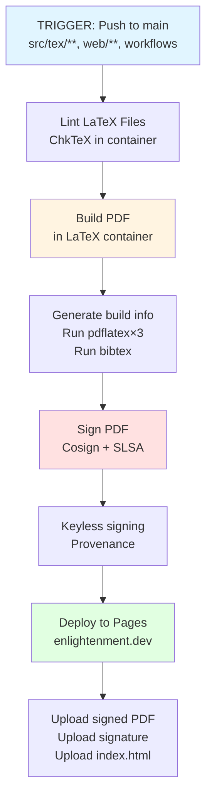
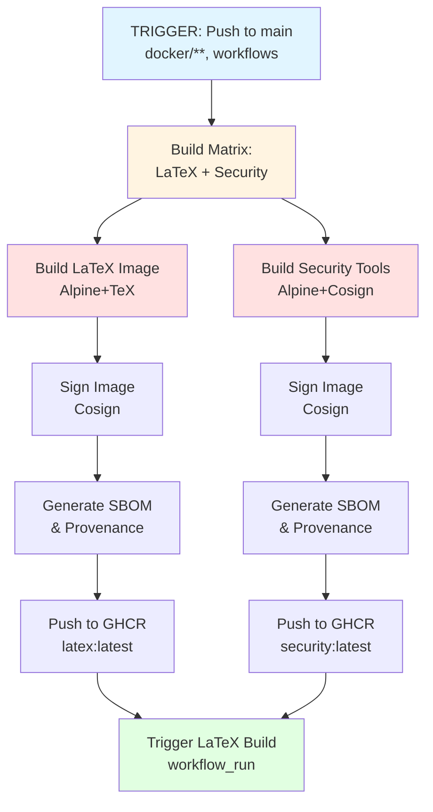

# CI/CD Architecture

**Last Updated:** 2025-11-17
**Audience:** Maintainers, Contributors

This document explains the CI/CD workflow architecture for the Coordination Trilemma project.

## Overview

The project uses GitHub Actions with three main workflows:
1. **Docker Build** - Builds and signs custom container images
2. **LaTeX Build & Deploy** - Compiles, signs, and publishes the PDF
3. **Sign PDF** (deprecated) - Now integrated into workflow 2

## Workflow Diagrams

### Main Build Pipeline



### Docker Build Workflow



## Workflow Files

### 1. `.github/workflows/docker-build.yml`

**Purpose:** Build and publish Docker images

**Triggers:**
- Push to `main` branch
- Changes to `docker/**` or `.github/workflows/docker-build.yml`
- Manual dispatch

**Images Built:**
1. **latex** - `ghcr.io/realnedsanders/coordination-trilemma/latex:latest`
   - Base: Alpine Linux edge
   - Contents: TeXLive (minimal), ChkTeX, make, git, perl
   - Size: ~500MB-1GB

2. **security** - `ghcr.io/realnedsanders/coordination-trilemma/security:latest`
   - Base: Alpine Linux
   - Contents: Cosign, curl, git, bash
   - Size: ~50-100MB

**Key Features:**
- Matrix build for parallel execution
- OCI labels with build metadata
- Cosign keyless signing
- SLSA provenance attestations
- SBOM generation
- Trivy vulnerability scanning

**Outputs:**
- Signed images pushed to GitHub Container Registry
- Build artifacts and scan results

### 2. `.github/workflows/latex-build-deploy.yml`

**Purpose:** Build PDF, sign it, and deploy to GitHub Pages

**Triggers:**
- Push to `main` branch
- Changes to `src/tex/**`, `web/**`, or the workflow file itself
- After Docker image rebuild completes (`workflow_run`)
- Manual dispatch

**Important:** Does NOT trigger on changes to `docker/**` or `Makefile` alone to prevent double-triggering.

**Jobs:**

#### Job 1: Lint
- Runs ChkTeX on all `.tex` files
- Checks for common LaTeX issues
- Continues even if warnings found

#### Job 2: Build
- **Container:** `ghcr.io/realnedsanders/coordination-trilemma/latex:latest`
- **Steps:**
  1. Checkout code (full history for provenance)
  2. Configure git safe directory
  3. Generate build info with git metadata
  4. Run `make all` (Makefile auto-detects CI environment)
  5. Upload PDF artifact
  6. Upload build logs

**Key Detail:** Makefile detects `GITHUB_ACTIONS` env var and uses `COMPILE_METHOD=local` since it's already inside a container.

#### Job 3: Sign
- **Condition:** Only on push to main OR successful workflow_run
- **Container:** `ghcr.io/realnedsanders/coordination-trilemma/security:latest`
- **Steps:**
  1. Download PDF artifact from build job
  2. Sign with Cosign (keyless via Sigstore)
  3. Generate SLSA provenance attestation
  4. Upload signed PDF and signature bundle

#### Job 4: Deploy
- **Condition:** Only on push to main OR successful workflow_run
- **Steps:**
  1. Download signed PDF artifact
  2. Copy `web/index.html`
  3. Configure GitHub Pages
  4. Deploy to enlightenment.dev

**Critical:** Sign job runs BEFORE deploy, ensuring only signed PDFs are published.

### 3. `.github/workflows/sign-pdf.yml` (Deprecated)

**Status:** Disabled (signing now integrated into latex-build-deploy.yml)

Previously signed PDFs after deployment using `workflow_run` trigger, but this meant unsigned PDFs were briefly published. Now deprecated in favor of signing before deployment.

## Trigger Logic & Path Filters

### Why Path Filters Matter

GitHub Actions can filter workflow triggers by file paths. This prevents unnecessary runs and avoids conflicts.

**Problem Solved:** When both `docker/**` and `src/tex/**` files change in one push:
- OLD: Both workflows trigger immediately
  - latex-build-deploy runs first (uses old Docker image) → FAILS
  - docker-build runs, rebuilds images
  - docker-build completion triggers latex-build-deploy again → succeeds
- NEW: Only docker-build triggers
  - Rebuilds images
  - Triggers latex-build-deploy via workflow_run → succeeds once

**Implementation:**

```yaml
# docker-build.yml
on:
  push:
    paths:
      - 'docker/**'
      - '.github/workflows/docker-build.yml'

# latex-build-deploy.yml
on:
  push:
    paths:
      - 'src/tex/**'
      - 'web/**'
      - '.github/workflows/latex-build-deploy.yml'
      # Note: Excludes docker/** and Makefile
  workflow_run:
    workflows: ["Build Docker Images"]
    types: [completed]
```

### Event Type Handling

Workflows can be triggered by different event types (`push`, `workflow_run`, etc.). Job conditions must handle all relevant types.

**Problem Solved:** Sign and deploy jobs had conditions like:
```yaml
if: github.event_name == 'push' && github.ref == 'refs/heads/main'
```

This skipped the jobs when triggered via `workflow_run` (event name is `workflow_run`, not `push`).

**Solution:**
```yaml
if: |
  (github.event_name == 'push' && github.ref == 'refs/heads/main') ||
  (github.event_name == 'workflow_run' && github.event.workflow_run.conclusion == 'success')
```

Now jobs run on both direct pushes AND after successful Docker rebuilds.

## Build Environment Details

### Makefile CI Detection

The Makefile automatically detects CI environments:

```makefile
ifdef GITHUB_ACTIONS
    COMPILE_METHOD ?= local
else
    COMPILE_METHOD ?= docker
endif
```

**Why:** CI runs inside a container, so using `COMPILE_METHOD=docker` would attempt Docker-in-Docker, which fails. Instead, we use `COMPILE_METHOD=local` to run LaTeX commands directly.

### Git Configuration

CI containers have git ownership checks that fail by default:

```yaml
- name: Configure git safe directory
  run: |
    git config --global --add safe.directory "$GITHUB_WORKSPACE"
    git config --global --add safe.directory "$(pwd)"
```

This allows `scripts/generate-build-info.sh` to access git metadata for build provenance.

### Full Git History

```yaml
- name: Checkout code
  uses: actions/checkout@v4
  with:
    fetch-depth: 0  # Full history, not shallow clone
```

**Why:** Build provenance includes git commit information. Shallow clones don't have full history, causing "unknown" in build info.

## Security Model

### Signing with Cosign

**Method:** Keyless signing via Sigstore
- No long-lived keys to manage
- Identity from GitHub OIDC token
- Certificates from Fulcio CA
- Transparency via Rekor log

**What's Signed:**
- Docker images (both latex and security)
- PDF artifacts
- All with provenance attestations

**Verification:**
```bash
# Verify PDF
cosign verify-blob --bundle main.pdf.cosign.bundle \
  --certificate-identity-regexp="^https://github.com/realnedsanders/Coordination-Trilemma" \
  --certificate-oidc-issuer=https://token.actions.githubusercontent.com \
  main.pdf

# Verify Docker image
cosign verify \
  --certificate-identity-regexp="^https://github.com/realnedsanders/Coordination-Trilemma" \
  --certificate-oidc-issuer=https://token.actions.githubusercontent.com \
  ghcr.io/realnedsanders/coordination-trilemma/latex:latest
```

### SLSA Provenance

**Level Achieved:** SLSA Build Level 3

**Attestations Include:**
- Build platform (GitHub Actions)
- Builder identity (workflow)
- Source materials (git commit, Dockerfile)
- Build invocation (commands run)
- Build metadata (timestamp, parameters)

**Generated By:**
- `actions/attest-build-provenance@v1` for PDFs
- `docker/build-push-action` + Cosign for images

### Permissions

Workflows use minimal permissions (principle of least privilege):

```yaml
permissions:
  contents: read          # Read repo
  packages: write         # Push to GHCR
  id-token: write         # Cosign keyless signing
  attestations: write     # SLSA provenance
  pages: write            # Deploy to Pages
```

## Deployment

### GitHub Pages Configuration

**Custom Domain:** enlightenment.dev
**Source:** GitHub Actions deployment
**Contents:**
- `main.pdf` - Signed PDF
- `main.pdf.cosign.bundle` - Signature bundle
- `index.html` - Landing page

**Setup:**
1. Repository Settings → Pages
2. Source: "GitHub Actions"
3. Custom domain: enlightenment.dev
4. DNS: CNAME record pointing to `<user>.github.io`

### Published Artifacts

**Public Access:**
- https://enlightenment.dev - Landing page
- https://enlightenment.dev/main.pdf - PDF
- https://enlightenment.dev/main.pdf.cosign.bundle - Signature

**GitHub Artifacts** (time-limited):
- coordination-trilemma-pdf (30 days)
- coordination-trilemma-pdf-signed (90 days)
- build-logs (7 days)

## Debugging Workflows

### View Logs
1. Go to GitHub Actions tab
2. Click on workflow run
3. Click on job name
4. Expand steps to see output

### Common Issues

**Build fails with "docker: command not found":**
- Makefile trying to use Docker inside container
- Fix: Ensure `GITHUB_ACTIONS` env var is set
- Makefile auto-detects and uses local compilation

**Sign/deploy jobs skipped:**
- Check event type and conditions
- Verify workflow_run succeeded
- Check branch is `main`

**Provenance shows "unknown":**
- Check git is available in container
- Check full history checkout (`fetch-depth: 0`)
- Check git safe directory configured

### Manual Workflow Trigger

All workflows support `workflow_dispatch` for manual triggering:

1. Go to Actions tab
2. Select workflow
3. Click "Run workflow"
4. Choose branch and options

## Maintenance

### Updating Docker Images

1. Edit `docker/Dockerfile.latex` or `docker/Dockerfile.security`
2. Push to `main`
3. `docker-build.yml` automatically rebuilds and signs
4. New images pushed to GHCR
5. `latex-build-deploy.yml` triggered with new images

### Updating Workflows

1. Edit `.github/workflows/*.yml`
2. Test changes carefully (breaking CI is bad!)
3. Consider testing in a fork first
4. PR with clear description of changes

### Adding New Workflows

1. Create `.github/workflows/name.yml`
2. Document purpose and triggers
3. Add appropriate permissions
4. Consider dependencies on other workflows
5. Update this document

## Performance Optimization

**Current Optimizations:**
- Custom Alpine images (~500MB vs ~5GB)
- No tool installation during runs
- Cached Docker layers
- Parallel job execution where possible
- Path filters to skip unnecessary runs

**Build Times:**
- Docker build: ~2-3 minutes
- LaTeX lint: ~30 seconds
- PDF build: ~1-2 minutes
- Sign: ~30 seconds
- Deploy: ~30 seconds
- **Total: ~4-6 minutes** for full pipeline

## Future Improvements

**Potential Enhancements:**
- Reproducible builds (SOURCE_DATE_EPOCH)
- Dependency pinning for Alpine packages
- Build cache for faster rebuilds
- Matrix testing (multiple LaTeX versions)
- Automated link checking in docs
- Performance benchmarking

## Related Documentation

- [BUILD.md](BUILD.md) - Local build instructions
- [SECURITY.md](SECURITY.md) - Security verification
- [TROUBLESHOOTING.md](TROUBLESHOOTING.md) - Common issues
- [docker-setup.md](docker-setup.md) - Docker details
- [SLSA_ROADMAP.md](SLSA_ROADMAP.md) - Path to Level 4

---

**Questions or Issues?**

Open an issue with `[ci]` or `[workflow]` tag.
