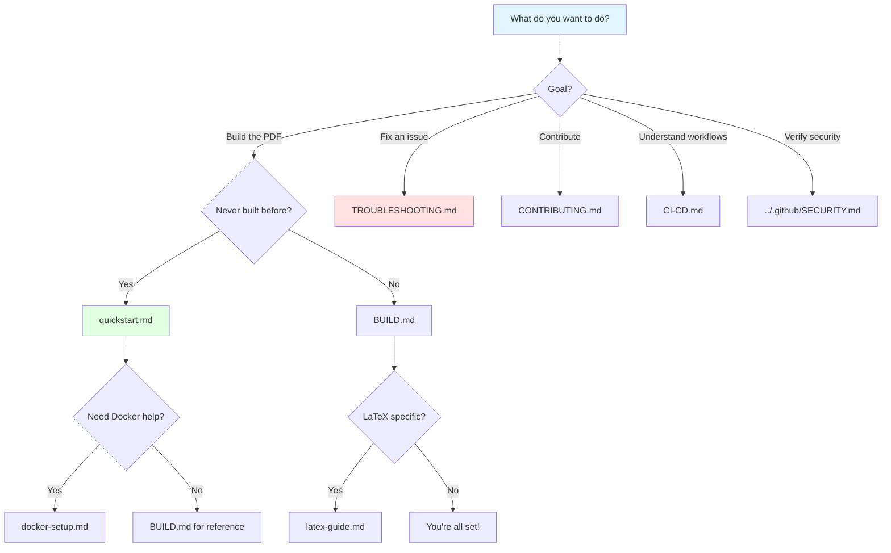

# Coordination Trilemma - Documentation

**Last Updated:** 2025-11-17

This directory contains all technical and development documentation for the Coordination Trilemma project.

## Which Doc Should I Read?



## Documentation Index

### For Readers

- **[Main README](../README.md)** - Overview of the paper's content and arguments

### For Builders

- **[Quick Start Guide](quickstart.md)** - Get started quickly (new users start here!)
- **[BUILD.md](BUILD.md)** - Complete build instructions and project structure
- **[LaTeX Guide](latex-guide.md)** - LaTeX compilation details
- **[Docker Setup](docker-setup.md)** - Docker installation and configuration
- **[TROUBLESHOOTING.md](TROUBLESHOOTING.md)** - Common issues and solutions

### For Contributors & Maintainers

- **[CONTRIBUTING.md](../CONTRIBUTING.md)** - How to contribute to the project
- **[CI-CD.md](CI-CD.md)** - Workflow architecture and debugging
- **[CHANGELOG.md](../CHANGELOG.md)** - Project history and changes
- **[DOCS_STYLE_GUIDE.md](DOCS_STYLE_GUIDE.md)** - Documentation standards and best practices

### For Security & Verification

- **[SECURITY.md](../.github/SECURITY.md)** - Security documentation and artifact verification
- **[SLSA Roadmap](SLSA_ROADMAP.md)** - Path to SLSA Build Level 4

### Planning & Historical

- **[CLEANUP_AND_SLSA4_PLAN.md](CLEANUP_AND_SLSA4_PLAN.md)** - Repository reorganization plan (Part 1 completed)

## Quick Reference

### First Time Setup

```bash
# 1. Install Docker (one-time)
# macOS: brew install --cask docker
# Linux: curl -fsSL https://get.docker.com | sh

# 2. Build PDF
make docker-pull
make

# Done! PDF at: main.pdf
```

### Common Commands

```bash
make                    # Build PDF
make view              # Open PDF
make clean             # Clean build files
make help              # Show all commands
```

### Getting Help

1. Check [TROUBLESHOOTING.md](TROUBLESHOOTING.md) for common issues
2. Read relevant guide (BUILD, Docker, LaTeX)
3. Search [GitHub Issues](https://github.com/realnedsanders/Coordination-Trilemma/issues)
4. Open new issue if needed

### Published Version

- **Landing page:** <https://enlightenment.dev>
- **Direct PDF:** <https://enlightenment.dev/main.pdf>
- **Verify:** `./scripts/verify-signatures.sh`

## Contributing

This is an academic paper under active development. We welcome:

- Corrections to mathematical proofs or logical errors
- Additional historical evidence or counterexamples
- Clarifications of ambiguous statements
- References to relevant literature

Please open an issue or submit a pull request. Changes to the main argument require substantial justification.

See [BUILD.md](BUILD.md) for information about the project structure and development workflow.
