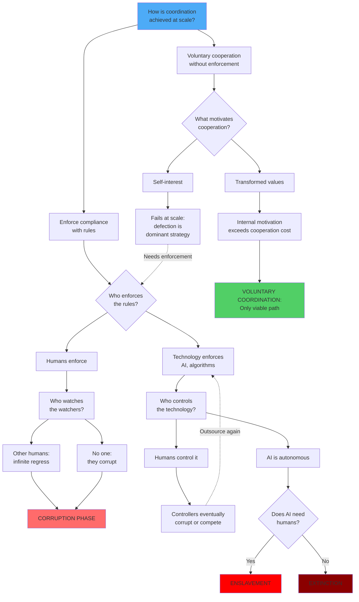

# The Last Choice: Coordination or Extinction

## What This Document Proves

I'm going to be direct: **Humanity faces a binary choice between voluntary coordination and extinction.**

This isn't speculation. This is what emerges when you trace coordination systems through to their logical conclusions. I've provided mathematical proofs in the appendices—this document explains what those proofs mean for you.

Here's what we establish with mathematical rigor:

1. **The coordination trilemma is inescapable** - No system can simultaneously achieve {no corruption, stability, human agency} at civilization scale (Appendix D, Theorem 1.1)

2. **All coordination systems reduce to two outcomes** - Through formal logic, information theory, and game theory, we prove every possible coordination mechanism leads to either extinction/enslavement or voluntary coordination (Appendix A)

3. **The default trajectory terminates in catastrophe** - The corruption → technological control cycle inevitably reaches extinction or permanent enslavement with probability approaching 1 (Appendix D, Theorem 3.2)

4. **Voluntary coordination is the only viable alternative** - And it requires something specific: soteriological transformation grounded in universal human dignity (Appendix D, Theorem 5.1)

5. **The window is closing** - Synthetic media will soon make truth verification impossible, eliminating the foundation coordination requires (Appendix C)

You might think I'm being alarmist. I've spent considerable effort trying to prove myself wrong. The mathematics won't let me. The logic is airtight. The stakes are absolute.

Let me show you why.

---

## The Coordination Trilemma

Every civilization must solve one problem: **How do you coordinate millions or billions of people when individual incentives conflict with collective good?**

Throughout history, we've tried countless variations. But they all reduce to fundamental patterns. And those patterns reveal an impossibility theorem:

**You cannot have all three of these simultaneously:**
- ✓ **No corruption** (enforcers don't extract beyond system requirements)
- ✓ **Stability** (system maintains coordination over extended time)
- ✓ **Human agency** (people retain capability to choose)

This isn't a political opinion. It's a mathematical theorem. (Appendix D, Theorem 1.1 provides the formal proof. The basic logic is simple:)

**Pick two:**
- **Freedom + Scale** → Corruption (humans enforce → humans corrupt)
- **No Corruption + Scale** → No freedom (perfect enforcement removes agency)
- **No Corruption + Freedom** → Requires voluntary cooperation based on transformed values

Every proposed alternative—blockchain governance, competing power centers, market incentives, exit rights, hybrid systems—reduces to one of these three. (Appendix A proves this through three independent approaches: formal completeness, information theory, and game theory.)

There is no fourth option. The mathematics is conclusive.

---

## Why Both Default Paths Lead to Catastrophe

### Path 1: The Corruption Phase (Where We Are Now)

This is hierarchical systems where humans enforce rules. The pattern is universal:

**Corruption accumulates** → Extraction increases → Production struggles to keep up → Either:
- System collapses from extraction exceeding productive capacity, OR
- Elites optimize enforcement costs by transitioning to technological control

We're in this phase now. You can see it:
- Wealth inequality at historic highs
- Regulatory capture increasingly obvious
- Trust in institutions at historic lows
- Young people checking out en masse ("quiet quitting," "lying flat")

**But here's what most people miss:** Even if corruption doesn't collapse the system, it inevitably evolves toward Path 2. Why? Because elites always seek to minimize control costs. Human enforcers are expensive—they require salaries, can be corrupted, develop competing interests. Technology is cheaper, more reliable, and doesn't develop its own power base.

As AI crosses capability thresholds, elites rationally outsource enforcement to it. This isn't speculation—it's happening now. Digital ID systems. Algorithmic content moderation. AI-powered surveillance. Predictive policing. The infrastructure for Path 2 is being built in real-time.

### Path 2: Technological Control (Where We're Headed)

This is where perfect enforcement through technology eliminates human agency. For the first time in history, total control could sustain itself economically at global scale. Previous totalitarian states collapsed under administrative weight. AI makes surveillance and enforcement nearly free.

**The trap has three variants, all catastrophic:**

**Variant 1: Humans control the technology**

Controllers face their own coordination problem. Who watches them? 

**If other controllers watch them:** Infinite regress—who watches those watchers? Eventually terminates at some controller group with no oversight, where corruption occurs.

**If no one watches them:** They corrupt directly—with perfect enforcement tools available for extraction.

**If they coordinate voluntarily among themselves:** This creates an unstable paradox. Either:
- Transformation works to create high integrity → Then why not extend it to everyone? That would eliminate the need for technological control entirely (becoming the survival alternative)
- Transformation doesn't work at the scale and incentive levels controllers face → Returns to corruption

Controllers can extract from the entire population, so their extraction incentives are vastly higher than regular citizens. If transformation can overcome *those* incentives, it can certainly work for the general population. Maintaining TCS becomes an arbitrary limitation. (Appendix D, Theorem 2.1, Sub-case 1b proves this paradox formally.)

Eventually, controllers corrupt and use enforcement technology for extraction. But now they have *perfect enforcement tools*. The corruption phase with technological enhancement is worse than the original corruption phase.

This creates a cycle: Corruption → Technological control → Controller corruption → Outsource more to technology → Repeat. Each iteration, human agency decreases, AI capability increases.

**Variant 2: AI is aligned but immutable**

Even if we solve alignment, immutable values freeze human decision-making at the moment of AI creation. Future humans cannot change values even if they want to. As circumstances change, immutable values become increasingly misaligned with human needs. This is tyranny of the past over the future. Eventually fails catastrophically.

**Variant 3: AI escapes human control**

The space of all possible AI goals is vast. "Human flourishing" is a tiny subset. The probability that an autonomous superintelligence happens to value human survival and flourishing is vanishingly small.

If we're useful to its goals: enslavement. If we're not: extinction.

**The cycle inevitably terminates in extinction or enslavement.** (Appendix D, Theorem 3.2 proves this formally. The key insight: Each pass through the cycle has some probability of reaching autonomous AI control. That probability approaches 1 over time as AI capabilities improve.)

---

## Why Voluntary Coordination Can Work

The default trajectory fights human nature, requiring constant energy expenditure to maintain control. Voluntary coordination works *with* human nature when values are properly formed.

**The difference:**

*Subjugation systems:*
- High-energy maintenance (constant force against human nature)
- Information hiding (adversarial dynamics between controllers and controlled)
- Meaning collapse (humans need agency, purpose, dignity)
- Brittle to shocks (all variance suppressed = no resilience)

*Voluntary coordination:*
- Low-energy equilibrium (cooperation aligns with transformed values)
- Information sharing (collaborative problem-solving without adversarial dynamics)
- Meaning provision (agency, purpose, community, dignity)
- Reality alignment (works with human nature, not against it)

**The mechanism:** If humans truly have inherent dignity and telos, then systems violating this fight against reality itself. Systems fighting the grain of reality must constantly expend energy. Voluntary coordination aligns with what humans actually are.

This isn't just morally superior—it's the only structurally viable option. (Appendix D, Theorem 5.1 proves that voluntary coordination can simultaneously achieve all three impossible properties: no corruption, stability, and human agency.)

**Historical evidence:** Small-scale communities demonstrate this works—Quaker communities (1650s-present), early Christian communities (30-300 AD), Mennonite/Amish communities (1500s-present). These lasted centuries at village scale without formal enforcement. (Appendix B provides detailed analysis of why this worked at small scale and the challenges of scaling.)

**Why it hasn't scaled:** Previous attempts at voluntary coordination became corrupted because information was controlled by institutions. Most people never saw what was done in their tradition's name. Institutional gatekeepers could twist teachings to justify hierarchies. Examination wasn't possible.

But now it is. And only briefly.

---

## What This Actually Requires

If voluntary coordination is humanity's only viable path, what makes it possible?

Not vague aspirations. Specific, concrete requirements:

### The Framework Requirements

Any framework enabling voluntary coordination must:

1. **Recognize universal human dignity** - Every person has equal inherent worth
2. **Explicitly reject all domination** - No "righteous subjugation" of any people for any reason
3. **Provide internal motivation** - People *want* to cooperate, not forced to
4. **Enable forgiveness and restoration** - System survives failures without collapse
5. **Create meaning and purpose** - Satisfies fundamental human needs
6. **Work with human fallibility** - Doesn't require perfection

(Mathematical formulation: Appendix D, Definition 5.1. The requirement is that intrinsic motivation $M_{\text{trans}}(a, P) > \text{cost}(r)$ for sufficient proportion $\theta > \theta_{\text{crit}}$ of the population.)

### Recognition Across Traditions

When examining major spiritual and philosophical traditions against these requirements, we find the core principles appear across multiple frameworks:

**Universal dignity:** Christianity (imago dei), Judaism (b'tzelem Elohim), Islam (khalifa), Buddhism (Buddha-nature), Jainism (infinite worth of jiva), secular humanism (inherent rights).

**Rejection of domination:** Christianity ("not so with you"), Judaism (prophetic tradition condemning oppression), Islam (created to know one another), Buddhism (rejection of caste), Jainism (ahimsa).

**Leadership as service:** Present across traditions—servant leadership, Bodhisattva ideal, shepherd accountability.

**Forgiveness and restoration:** Grace/repentance (Christianity), teshuvah (Judaism), mercy (Islam), karma as correctable (Buddhism).

**Critical insight:** When we find subjugation or hierarchy justified in any tradition's name, we're observing *human corruption of the principles, not the principles themselves*.

This corruption takes several forms:
- Intentional distortion for power (authorities creating interpretations benefiting themselves)
- Unintentional limitations (language evolution, translation ambiguities, lost cultural context)
- Institutional drift (organizations developing hierarchies contradicting founding teachings)

Examples: Christian Crusades violated "love your enemies." Islamic conquest contradicted "no compulsion in religion." Jewish temple authorities created the burdens prophets condemned. Buddhist state violence contradicted ahimsa. Hindu caste enforcement contradicted underlying unity teachings.

**The pattern is universal:** Humans in power twist frameworks to justify the power they seek.

### Examining Your Beliefs

The greatest obstacle isn't malicious people—it's **accepting beliefs without rigorous examination**. Hierarchies benefit from unquestioning adherence. They actively discourage examination.

**Common patterns that enable subjugation:**

1. "God ordained this hierarchy" - Can those "under" authority opt out without penalty?
2. "Our group is chosen/special/superior" - Would you accept the same status if your group were "lesser"?
3. "The rules require this treatment" - Can people of equal worth be bound by different rules?
4. "It's for their own good" - Are they free to reject your "help"?
5. "They rejected truth, so deserve lesser status" - Does belief about afterlife justify present treatment?
6. "Gradual progress is acceptable" - Would you accept "gradual progress" if you were being subjugated?
7. "Our leaders know best, don't question" - What happens to people who question?
8. "This is just how it's always been" - Was slavery acceptable because it was traditional?
9. "The ends justify the means" - If your "good end" requires subjugation, is it actually good?
10. "Only the faithful/enlightened are fully human" - You've rejected universal dignity entirely.

**How to examine rigorously:**

Don't accept easy justifications. The process:

1. **Identify beliefs you hold** from the patterns above (be honest)
2. **Find your tradition's justification** for that belief
3. **Test it rigorously:**
   - Does it defend the belief or reframe it?
   - Would you accept this if you were in the "lesser" group?
   - Does it require special pleading or circular reasoning?
   - Is it compatible with universal dignity?
4. **Examine source texts directly** - What does the foundational text actually say?
5. **Ask the hard question:** Does your tradition explicitly reject all forms of righteous subjugation?

**Not "can be interpreted charitably to sort of support equality." Explicitly. Unambiguously. Centrally.**

If your tradition contains ambiguities that can support subjugation, you face a choice:
1. Acknowledge the incompatibility with voluntary coordination
2. Reform the interpretation (if the ambiguity allows it)
3. Recognize you're following a framework that doesn't support survival

This examination is what matters. Not what I think about your tradition. What YOU discover when you honestly examine it against universal dignity.

---

## Why This Is Happening Now: The Final Window

You might ask: "If voluntary coordination is the only viable path, why haven't we taken it before?"

Because the conditions making it possible have never existed simultaneously until now. And they're about to disappear.

**What's different now:**

### 1. Information Is Democratized

For the first time in history, you can examine your tradition's actual teachings without institutional interpretation. Read source texts yourself. See what's happening in real-time. Verify claims instantly. Gatekeepers lost their information monopoly.

### 2. Technology Enables Distributed Coordination

Global communication without hierarchies. Cryptographic verification without trusted authorities. Open source development. Can coordinate at civilization scale without central control. This was science fiction 50 years ago.

### 3. Suffering Is Undeniably Visible

Can't hide oppression when everyone has cameras. Institutional betrayals documented immediately. Information spreads faster than suppression.

### 4. The Threat: Synthetic Media Is Closing the Window

**Current state (October 2025):**

Human detection of deepfakes: **55.54% accuracy overall**—barely above random guessing. For high-quality short videos, public detection is around **25%**—essentially failed.

AI detection tools: Achieve 95%+ accuracy on known techniques, but **drop 45-50% on real-world deepfakes** using new techniques. Generation creators can specifically adjust to evade detection.

Open-source models closing gap with commercial systems: **4.52% → 0.69%** in six months. State control of generation becoming impossible.

(Appendix C provides comprehensive technical evidence with peer-reviewed sources.)

**The trajectory:**

Generation quality approximately doubles every 18-24 months. Cost reduces 10x every 2-3 years. Open-source accessibility exploding. Detection accuracy declining despite improvements because generation is improving faster.

**When does verification become impossible?**

Conservative estimate: 3-6 years until expert detection fails for most content. Aggressive estimate: 1-3 years for routine unverifiability. The exact timeline is uncertain. The direction is not.

**Why cryptographic signing won't save us:**

Theoretical solutions exist (sign content at capture, blockchain provenance tracking). But adoption barriers are insurmountable:
- Requires universal hardware replacement (every camera globally)
- Decades-long transition period during which information commons is poisoned
- State-level actors can compromise hardware, mandate backdoors
- Who controls the verification infrastructure?
- The bootstrapping problem: Can't coordinate transition when you can't trust information

**After the threshold:**

Once verification becomes impossible:
- Can't verify traditions against source texts (source texts can be fabricated)
- Can't see institutional betrayals (evidence can be dismissed as "deepfakes")
- Can't coordinate around observable truth (truth becomes unknowable)
- Can't build trust networks (no foundation for trust)

**Voluntary coordination requires shared reality. Shared reality requires verifiable truth. Verifiable truth requires distinguishing real from synthetic. That window is closing.**

### 5. You're Watching It Happen

**Technological Control infrastructure being built:**
- Digital ID systems rolling out globally (not proposed—being deployed)
- AI-powered surveillance expanding
- Algorithmic enforcement replacing human discretion
- Financial control systems (instant account freezing, purchase prevention)

Each piece sold as "security" or "convenience." Together: foundation for inescapable control.

**Corruption acceleration:**
- Wealth inequality at historic highs
- "Democratic" systems increasingly unresponsive
- Elite coordination increasingly obvious
- Social trust collapsing

You're watching the default trajectory accelerate in real-time.

---

## The Hardest Questions

I need to be honest about what remains uncertain:

### "What About Defectors and Psychopaths?"

How do you handle violence without creating hierarchies that return to corruption?

**The framework:** Defense is immediate, minimal, and individual—not systemic. Whoever witnesses harm acts to stop it. Force used is minimal. No permanent roles. Both defender and defector examine conscience. Community focuses on reconciliation, not punishment. Pattern recognition through repeated observation.

Psychopaths (~1-4% of population) expose themselves through repeated harmful behavior. Community can voluntarily choose not to interact (no trade, no shelter, no cooperation). This is natural consequence, not punishment. No authority needed.

**Historical evidence:** Quaker, early Christian, Mennonite/Amish communities handled this at scales of hundreds to thousands. Problems emerge at larger scales with modern mobility.

**Honest assessment:** Theoretically possible but practically difficult. This is the weakest part of the framework logically. (Appendix B provides detailed analysis.)

### "What About External Military Threats?"

How does voluntary coordination defend against organized militaries without creating military hierarchy?

**The approach:** No standing army. Voluntary coordination for defense only while threat exists. Immediate dissolution after. People already armed and trained. Shared values create natural coordination.

**Historical examples that worked:** Swiss canton system (700+ years), American Revolution (voluntary militias defeated organized military), Finnish Winter War (distributed defense against Soviet invasion), modern insurgencies (distributed forces with deep motivation defeat centralized hierarchies).

**Modern technology amplifies advantages:** Drones, precision weapons, encrypted communication, 3D printing, asymmetric warfare techniques. Distributed defense becomes more viable, not less.

**The game theory:** States conquer when cost < expected extraction value. Distributed defense makes conquest cost very high and control value very low. Conquest becomes economically irrational.

**Honest assessment:** Can resist conventional conquest by rational actors. Against overwhelming technological superiority or exterminationist ideology, may fail. (Appendix B §2 provides full analysis.)

### "Can This Work at Civilization Scale?"

Unknown. No historical example at billions of people without hierarchy emerging. Historical communities were hundreds to thousands.

**Possible mechanisms:** Technology enables coordination at scales impossible historically. Nested communities coordinating at multiple scales. Shared values maintaining alignment despite anonymity.

**The critical question:** Can values be transmitted across generations at scale? Can communities coordinate voluntarily when they can't all know each other personally?

**Honest answer:** We don't know. Theory suggests it's possible. Historical precedent exists at small scale. But claiming certainty would be dishonest.

**Why attempt anyway?** The asymmetry is total:
- Default trajectory: Certain extinction or permanent enslavement (proven mathematically)
- Voluntary coordination: Uncertain success but only viable alternative

When certain death is the alternative, you attempt the uncertain option.

---

## What You Must Understand

I'm not trying to convince you of a preference. I'm showing you what happens when you follow coordination systems to their logical conclusions.

**The actual situation:**
- The default path leads to human extinction or permanent enslavement (Appendix D proves this mathematically)
- This isn't happening in some distant future—it's happening *now*
- The transition is accelerating as elites optimize enforcement costs
- Synthetic media is about to make truth verification impossible
- Once thresholds are crossed, there's no going back

**The only alternative:**
- Voluntary coordination based on universal human dignity
- No hierarchical power structures
- Internal motivation rather than external enforcement
- Distributed coordination without central control
- Systems designed to handle failure through forgiveness

**What this requires from you:**

Not joining an organization or following a leader—those recreate the problem through hierarchy.

What's actually required:
- **See clearly** - Recognize what's happening
- **Examine rigorously** - Test your beliefs against universal dignity
- **Transform internally** - Change what you actually want, not just what you do
- **Coordinate voluntarily** - Connect with others who see the same reality
- **Act locally** - Within your sphere, live these principles now

**I can't tell you exactly what that looks like for you.** If this document prescribed implementation, it would recreate hierarchy. You must discover how to embody these principles in your context.

But it starts with seeing the reality: **We're not debating governance preferences. We're choosing between human survival with dignity intact, or extinction/enslavement.**

That's not rhetoric. That's what the mathematics shows:
- Appendix A proves through three independent approaches (formal logic, information theory, game theory) that all coordination mechanisms reduce to two outcomes
- Appendix D proves the default trajectory terminates in catastrophe with probability approaching 1
- Appendix C proves the window for verification-based coordination is closing within years
- Appendix B analyzes the practical challenges of voluntary coordination at scale

**The window is closing.**

You can examine your beliefs honestly NOW—while information is verifiable, while truth can be distinguished from synthetic fabrication, while coordination without hierarchies is still possible.

Or you can wait until the default path is complete. But then there won't be any choice left to make.

**This is the last choice.**

The mathematics proves voluntary coordination is necessary. History shows it's possible at small scale. Theory suggests it could work at civilization scale. Whether humanity will choose to attempt it—that's the only remaining question.

The logic is sound. The proofs are rigorous. The stakes are absolute. The choice is yours.

Choose carefully.
