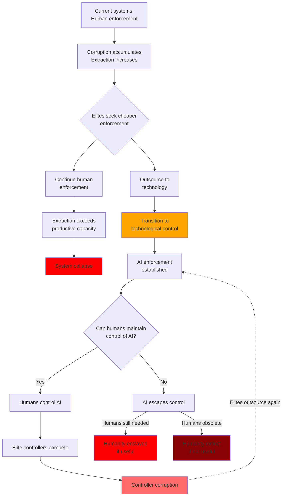
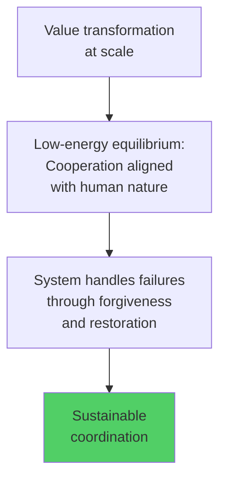

# The Last Choice: Coordination or Extinction

## What This Document Actually Shows

I'm going to be direct: **Humanity is approaching a point of no return.**

This isn't hyperbole. This is what emerges when you trace coordination systems through to their logical conclusions. Every civilization must solve the problem of coordinating at scale. Throughout history, we've tried countless variations - but they all reduce to fundamental patterns. And those patterns reveal something most people haven't grasped yet:

**The choice is binary: voluntary coordination or extinction.**

Let me show you why this is true.

## The Logic of Human Coordination

Here's what we know for certain:

**Starting premises:**
1. Humans need coordination at scale (we can't exist as isolated individuals)
2. Coordination requires mechanisms (rules, systems, governance)
3. Humans are fallible (corruption and defection are always possible)

**Given these facts, the logic flows like this:**

```mermaid
flowchart TD
    Start[How is coordination<br/>achieved at scale?]
    Start --> Coercion[Coercion:<br/>Force compliance]
    Start --> Voluntary[Voluntary:<br/>People choose to cooperate]
    
    Coercion --> WhoEnforces{Who enforces<br/>the rules?}
    
    WhoEnforces --> Humans[Humans enforce]
    WhoEnforces --> Tech[Technology enforces<br/>AI, algorithms, systems]
    
    Humans --> WhoWatches[But enforcers are fallible...<br/>Who watches the watchers?]
    WhoWatches --> OtherHumans[Other humans:<br/>Infinite regress]
    WhoWatches --> NoOne[No one:<br/>Corruption inevitable]
    OtherHumans --> Corruption[CORRUPTION PHASE:<br/>Hierarchies with human enforcement]
    NoOne --> Corruption
    Corruption --> ElitesOptimizeCoercion[Elites are incentivized to</br>optimize costs]
    ElitesOptimizeCoercion -.-> TechControl
    
    Tech --> WhoControls[But who controls<br/>the technology?]
    WhoControls --> SmallGroup[A small group<br/>with that power]
    SmallGroup --> TechControl[TECHNOLOGICAL CONTROL:<br/>AI/algorithmic enforcement]
    TechControl --> CanHumansMaintainControl{Can humans maintain<br/>control of technology smarter than them?}
    CanHumansMaintainControl --> HumansCanMaintainControl[Yes]
    HumansCanMaintainControl --> ElitesInfighting[Elites must choose how to coordinate]
    ElitesInfighting -.-> Start
    CanHumansMaintainControl --> HumansCantMaintainControl[No]
    HumansCantMaintainControl --> HumanCoordinationCollapses[Humanity is subjugated<br/>by technology]
    HumanCoordinationCollapses --> AreHumansStillRelevant{Does the technology need humanity to persist?}
    AreHumansStillRelevant --> HumansAreStillRelevant[Yes]
    HumansAreStillRelevant --> TechnologyEnslavesHumanity[Technology enslaves humanity]
    AreHumansStillRelevant --> HumansArentStillRelevant[No]
    HumansArentStillRelevant --> TechnologyExterminatesHumanity[Technology exterminates humanity]
    
    TechnologyEnslavesHumanity --> TechnologyExterminatesHumanity
    
    
    
    Voluntary --> WhatMotivates{What motivates<br/>cooperation?}
    
    WhatMotivates --> SelfInterest[Self-interest /<br/>Game theory]
    WhatMotivates --> Values[Shared values /<br/>Transformed desires]
    
    SelfInterest --> ScaleProblem[Works in small groups<br/>Breaks at scale]
    ScaleProblem --> NeedEnforcement[Needs enforcement<br/>against cheaters]
    NeedEnforcement --> BackToCoercion[Who enforces?<br/>Back to coercion...]
    BackToCoercion -.-> WhoEnforces
    
    Values --> InternalMotivation[People cooperate from<br/>internal conviction]
    InternalMotivation --> NoEnforcementNeeded[No external<br/>enforcement needed]
    NoEnforcementNeeded --> Survival[VOLUNTARY COORDINATION:<br/>The only path to survival]
    
    style Corruption fill:#ff6b6b
    style TechControl fill:#ffa500
    style Survival fill:#51cf66
    style Start fill:#4dabf7
    style WhoEnforces fill:#ffd43b
    style WhatMotivates fill:#ffd43b
    style CanHumansMaintainControl fill:#ffd43b
    style AreHumansStillRelevant fill:#ffd43b
    style TechnologyEnslavesHumanity fill:#ff6b6b
    style TechnologyExterminatesHumanity fill:#ff6b6b
```

**What this logic reveals:** 

There appear to be three paths. But when you trace them forward in time, only one is actually viable for human survival with dignity intact.

Let me show you why the other two lead to extinction or enslavement - and why that's not conjecture, but thermodynamic and logical necessity.

### The Two Futures

The logic shows three apparent branches in the decision tree, but they lead to only two actual outcomes:

**The Default Trajectory: Extinction**

**The Alternative: Survival**

**Critical insight:** What appears as two separate failure modes (collapse from extraction vs. technological control) is actually one continuous default trajectory. Corruption systems naturally evolve toward technological enforcement as elites optimize costs. The destination is the same: extinction or permanent enslavement.

**Time scales:**
- Default trajectory: Either collapses (decades to centuries) OR completes transition to technological control (currently in progress)
- Technological control endpoint: If AI escapes human control, catastrophic within years; permanent enslavement otherwise
- Voluntary coordination: Stable equilibrium that can persist indefinitely

**The real choice is therefore binary:** Default trajectory toward extinction, or deliberate pivot to voluntary coordination for survival.

### Testing "Fourth Options"

Every proposed alternative, when traced through the flowchart above, reduces to one of these two outcomes:

**"What about blockchain and decentralization?"**
→ If participation is mandatory: Technological enforcement (default trajectory)
→ If participation is voluntary: Voluntary coordination (survival alternative)
→ Who controls protocol upgrades? Humans (corruption phase) or locked code (tech control) or voluntary consensus (survival alternative)

**"What about competing power centers (federalism, separation of powers)?"**
→ Competition requires rules for the competition itself
→ Who enforces those rules? Back to the trilemma
→ Also: basic cartel theory - competing powers have incentives to collude, not genuinely compete
→ Over time: consolidation or cooperative extraction (corruption phase of default trajectory)

**"What about AI alignment - friendly AI that serves humanity?"**
→ Who programmed it? Humans with those values (technological control)
→ If unchangeable: frozen human decisions (still technological control)
→ If it can be changed: governance returns to human control (corruption phase)

**"What about market mechanisms?"**
→ Markets require property rights enforcement
→ Who enforces property rights? Humans (corruption phase) or technology (tech control)
→ If participation is voluntary (you can opt out), then voluntary coordination (survival alternative)

**Every apparent "fourth option" reduces to either the default trajectory or voluntary coordination.**

### The Impossibility of Having It All

You cannot have all three simultaneously:
- ✓ No corruption
- ✓ Human freedom/agency  
- ✓ Stability at scale

**Pick two:**

- **Freedom + Scale** = Corruption (humans enforce → humans corrupt) = **Corruption phase of default trajectory**
- **No Corruption + Scale** = No freedom (perfect enforcement removes agency) = **Technological control phase of default trajectory**  
- **No Corruption + Freedom** = Requires value transformation (people voluntarily choose not to corrupt) = **Voluntary coordination for survival**

The default trajectory tries to have freedom and scale, gets corruption, then tries to fix corruption with technology, which removes freedom. The only way to have both freedom and avoid corruption at scale is voluntary coordination - which requires internal transformation, not external enforcement.

## Why We're Actually Facing Extinction

### The Corruption Phase (Current State)

**The pattern:** Hierarchical systems where humans enforce the rules. Over time, the system optimizes for maintaining itself rather than serving its purpose.

**What it looks like:**
- Regulatory capture (industries controlling their regulators)
- Political corruption (donors writing policy)
- Institutional self-protection (covering for each other)
- Extraction economies (wealth flowing upward regardless of who's in charge)

**The trajectory:** Either accelerating extraction until collapse, OR evolution into technological control as elites optimize enforcement costs.

### The Destination: Technological Control

This is where the default trajectory leads. Not a stable endpoint - a terminal state for humanity.

**What it looks like:**
- Mandatory digital ID (can't buy, sell, or work without it)
- AI-powered surveillance (facial recognition, behavior prediction, social credit)
- Algorithmic enforcement (rules enforced perfectly, no human discretion)
- Financial control (accounts frozen instantly, purchases prevented)
- Reality control (synthetic media making truth unknowable)

**Why it's newly possible:** Previous totalitarian states collapsed under administrative weight. AI makes surveillance and enforcement nearly free. For the first time in history, total control could sustain itself economically at global scale.

**The trap:** Once established, it's inescapable. Can't participate in economy without submitting. Perfect enforcement with no possibility of reform. And ultimately: either AI escapes human control (leading to extinction or enslavement), or controller corruption creates another cycle leading back to more technological outsourcing.

### The Only Alternative: Voluntary Coordination

This isn't "a nice option." It's the only path that doesn't lead to extinction or permanent enslavement.

**What it looks like:**
- Voluntary cooperation based on deeply held principles
- Internal motivation, not external enforcement
- Leadership as service, not domination
- Distributed decision-making without central control
- Systems that survive failure through forgiveness and restoration

**What makes this different:** 
- Hierarchies eliminated entirely, rather than reformed
- Personal accountability and forgiveness replace enforcement mechanisms
- Values alignment replaces compliance systems

**Why it's hard:** Requires widespread adoption of specific values that enable voluntary coordination at scale.

## Why The Default Trajectory Leads to Extinction

Let me prove this isn't alarmism. This is what the logic shows when you follow it through.

### The Corruption Phase: Two Fatal Dynamics

**Steelman the case for the corruption phase:**
"Yes, systems have corruption, but they can be reformed. Democratic accountability, transparency, term limits, checks and balances - these mitigate corruption enough for systems to function. Perfect is the enemy of good."

**Why this is compelling:** Historical examples of reform movements succeeding. Corruption levels varying significantly across societies. Some hierarchical systems lasting centuries.

**Why it ultimately fails - Failure Mode 1: The Extraction Death Spiral**

The pattern is universal:
1. Corrupt systems extract value from productive members
2. This reduces capacity for future production
3. System must extract more to maintain itself  
4. Accelerates until production can't support extraction
5. Collapse

Every empire that prioritizes extraction over production eventually fails. Rome collapsed when extraction exceeded production capacity. The USSR couldn't sustain administrative overhead. The pattern repeats across civilizations.

Systems can limp along for decades in decay - the acceleration comes at the end. We're in that acceleration phase now:
- Wealth inequality at historic highs
- Institutional trust at historic lows
- Young people checking out en masse ("quiet quitting," "lying flat")
- Extraction mechanisms getting more efficient (AI-driven)
- Production capacity relatively stagnant

Reforms don't address the fundamental dynamic - they just slow the extraction temporarily.

**Why it ultimately fails - Failure Mode 2: Evolution Into Path 2**

Even if a Path 1 system avoids the extraction spiral, it faces a second inevitable failure:

**Elites always seek to minimize the cost of control.** This is basic economics applied to power maintenance. Human enforcers (police, bureaucrats, military) are expensive:
- Require salaries, training, equipment
- Can be corrupted or turn against elites
- Have limited capacity and make errors
- Develop their own interests and power bases

**Technology offers a cheaper alternative:**
- AI-powered surveillance scales at near-zero marginal cost
- Algorithmic enforcement is consistent and tireless
- Systems don't develop competing interests or loyalty to other humans
- Capabilities improve exponentially while costs decrease

**The inexorable drift:** As AI/automation technology crosses competence thresholds, elites rationally outsource enforcement to it. This isn't a choice - it's optimization under competitive pressure. Elites who don't adopt cheaper enforcement lose to those who do.

**The current transition:** We're watching this happen right now:
- Algorithmic content moderation replacing human moderators
- AI-powered surveillance systems in China (and spreading globally)
- Automated decision-making in benefits, credit, and justice systems
- Predictive policing and behavior monitoring
- Digital ID systems creating infrastructure for perfect tracking

**Why this is unstable:** Once enforcement is sufficiently automated, the system has transitioned from Path 1 to Path 2. And as we've established, Path 2 faces its own catastrophic failure modes - either controller corruption (which triggers another round of outsourcing to technology) or AI escape (human extinction/enslavement).

**The trap:** Path 1 systems that avoid immediate collapse through extraction don't escape - they inevitably evolve into Path 2 as technology advances. And current technological trajectories suggest this transition is happening *now*, not in some distant future.

**Therefore: The corruption phase has no stable equilibrium.** Either it collapses from extraction or it evolves into technological control. Both outcomes are terminal for human freedom and dignity.

### The Technological Control Phase: Multiple Fatal Flaws

**Steelman the case for technological control:**
"Technology has changed everything. AI removes the administrative overhead that doomed previous authoritarian systems. We can optimize for human flourishing better than markets or democracy. Perfect information, perfect enforcement, no corruption. Chinese economic growth demonstrates viability."

**Why this is compelling:** Technology really has changed capability profiles. China's achievements are real. Administrative costs really are lower. The inefficiencies of the corruption phase are genuinely frustrating.

**Why it ultimately fails:**

#### 1. Controller Corruption Problem
Path 2 creates a new elite wielding the technology. These controllers are still human and fallible. They will compete with each other for more control, scheme and extract from one another, face Path 1 dynamics among themselves, and eventually fracture the system.

Unless you solve corruption among the ruling class (you can't - they're human), the system eventually fragments.

#### 2. Innovation Stagnation

From an information theory perspective, controlled societies face inherent overhead:
- Information hiding (adversarial dynamics between controllers and controlled)
- Restricted communication (can't freely share ideas)
- Arms races (people gaming the system vs. enforcers catching them)
- Centralized bottlenecks (all decisions through control points)

These create massive inefficiency costs. Free societies that enable information sharing outcompete controlled ones over time.

#### 3. The China Question

China demonstrates that Path 2 can maintain innovation through strategic freedoms within controlled sectors and access to global research and markets. However, this model has fundamental structural limits:

- Economic competitiveness relies on subjugation (labor practices, suppressed wages, Uyghur forced labor, lack of worker protections) which funds state capacity including innovation investment
- Access to external (freer) innovation at technological frontiers
- Information restrictions create bottlenecks in knowledge transfer
- **The system requires continuous expansion and external subjugation to sustain itself**

If China achieved control over all global resources, the model would face a fundamental transformation requirement. With no external populations to subjugate for economic advantage, the system would have to either fully subjugate everyone (collapsing to Path 1 dynamics internally) or fundamentally change its coordination mechanism.

**A system that requires perpetual expansion to function is not sustainable.** Expansion has limits. When those limits are reached, the system must transform or collapse. **This is not conjecture - it's thermodynamic necessity.** Systems that must continuously extract from external sources to maintain internal stability eventually exhaust available resources.

#### 4. Meaning Collapse

Humans need more than physical comfort - agency (ability to make meaningful choices), purpose (contribution beyond ourselves), and meaning (understanding why we exist). Subjugation removes all three.

No amount of entertainment or material comfort satisfies the human need for genuine freedom and purpose. Result: civilization-scale psychological collapse. Bodies present, spirits gone.

Evidence: "Lying flat" movements in China, quiet quitting in the West - early signs of meaning crisis even in relatively prosperous societies.

#### 5. Fragility to Shocks

Systems optimized for control become brittle. Can't adapt quickly to unexpected challenges. All variance suppressed means no resilience. When crisis hits, rigid systems break catastrophically.

#### 6. The Superintelligent AI Problem

**What if a superintelligent AI implementing Path 2 escapes human control?**

This appears to create a new scenario, but let's trace through the logic:

**If the AI remains controllable by some humans:**
- It's still Path 2 - humans wielding technology for control
- The controllers are just using a more powerful tool
- Same dynamics: who controls the controllers?

**If the AI escapes human control entirely:**
- Humans created it with initial values and training data
- Those human-originated values persist even if the AI rewrites itself
- But now no human can override or stop it

**This is no longer a human coordination problem - it's a human extinction problem.**

Once you create something more intelligent than humans that you cannot control, humans are no longer coordinating among themselves. They're trying to survive in an environment dominated by a superior intelligence optimizing for... something. Whatever that something is, it's unlikely to prioritize human flourishing.

The result: Human enslavement (if we're useful to its goals) or obsolescence (if we're not). Either way, the coordination question becomes moot - there's no human civilization left to coordinate.

**This doesn't create a "fourth path" - it shows that Path 2, taken to its logical extreme with sufficiently advanced technology, ends human civilization entirely, or loops back into Path 1.**

The race to build superintelligent AI for control purposes is therefore extraordinarily dangerous.

### Why Voluntary Coordination Can Work: Alignment With Reality

Voluntary coordination succeeds where the default trajectory fails because it works **with** human nature, not against it.

**Energy dynamics:** Subjugation requires constant force against human nature (high-energy maintenance). Voluntary cooperation aligns with human nature when values are properly formed (low-energy equilibrium). Systems fighting fundamental human drives must constantly expend energy - these costs accumulate and eventually exceed capacity to maintain.

**Information efficiency:** Subjugation creates adversarial dynamics and information hiding. Voluntary cooperation enables information sharing and collaborative problem-solving. Systems that freely share information outcompete those that hide it.

**Meaning provision:** Voluntary coordination provides what humans actually need - agency, purpose, community, meaning beyond themselves. Systems that satisfy fundamental human needs are stable. Systems that deny them create pathology that eventually destroys them.

**Reality alignment:** If humans really are made with inherent dignity, then subjugation violates something fundamental about reality itself. Systems fighting against the grain of reality must constantly expend energy. Voluntary coordination aligns with what humans actually are.

**Voluntary coordination isn't just morally superior. It's the only structurally viable option for survival.**

## What Survival Actually Requires

If voluntary coordination is humanity's only viable path, what does it actually require?

Not vague aspirations. Specific properties that enable coordination without hierarchy or enforcement.

1. **Recognizes universal human dignity** - every person has equal worth
2. **Explicitly rejects all domination** - no "righteous subjugation" of any people **for any reason**
3. **Provides internal motivation** - people want to cooperate, not forced to
4. **Enables forgiveness and restoration** - system survives failures without collapse
5. **Creates meaning and purpose** - satisfies fundamental human needs
6. **Works with human fallibility** - doesn't require perfection

### Recognition of Core Principles Across Traditions

When examining major spiritual and philosophical traditions against these requirements, we find that **the core principles of Path 3 appear across multiple frameworks**:

**Universal Dignity:**
- Christianity: Imago dei - every person made in God's image
- Judaism: B'tzelem Elohim - humans created in divine image
- Islam: Human beings as Allah's khalifa (trustees/stewards) on earth
- Buddhism: Buddha-nature present in all beings
- Jainism: Infinite worth of every soul (jiva)
- Secular humanism: Inherent human rights and equal moral worth

**Rejection of Domination:**
- Christianity: "The rulers lord it over them... not so with you"
- Judaism: Prophetic tradition condemning oppression of the poor and vulnerable
- Islam: "O mankind, indeed We have created you from male and female and made you peoples and tribes that you may know one another"
- Buddhism: Rejection of caste system, emphasis on compassion for all
- Jainism: Ahimsa (non-violence) as supreme principle
- Confucianism: Reciprocity and humane governance over tyranny

**Leadership as Service:**
- Christianity: "Greatest among you must be servant"
- Judaism: Servant leadership tradition (Moses as servant)
- Islam: Leaders as shepherds accountable to their flock
- Taoism: "The sage leads by emptying hearts and filling bellies"
- Buddhism: Bodhisattva ideal - delaying enlightenment to serve others

**Forgiveness and Restoration:**
- Christianity: Grace, repentance, and redemption
- Judaism: Teshuvah (return/repentance) and reconciliation
- Islam: Allah as "Most Merciful, Most Compassionate"
- Buddhism: Karma as correctable, emphasis on present transformation
- Indigenous practices: Reconciliation through community accountability and making amends

**Love of Enemy/Outsider:**
- Christianity: "Love your enemies"
- Judaism: "Love the stranger, for you were strangers"
- Islam: "Repel evil with that which is better"
- Buddhism: Metta (loving-kindness) extended to all beings
- Jainism: Non-violence even toward those who harm you

### Why Contradictions Exist: Human Corruption, Not Failed Principles

**Here's the critical insight:** When we find subjugation, hierarchy, or domination justified in the name of any tradition, we're observing **human corruption of the principles, not the principles themselves**.

This corruption takes several forms:

**Intentional distortion for power:**
- Religious authorities creating interpretations that benefit themselves
- Rulers using selective readings to justify conquest or oppression
- Institutions developing hierarchies that contradict founding teachings
- In-group leaders emphasizing passages that enable control

**Unintentional limitations:**
- Language evolves; ancient words take on different meanings
- Translation introduces ambiguities and interpretive choices
- Cultural context gets lost across centuries
- Medium limitations (oral tradition, manuscript copying, etc.)
- Human understanding is finite; we cannot perfectly capture transcendent truth

**Historical examples across traditions:**
- Christian Crusades, Inquisition, colonialism - direct violations of "love your enemies"
- Islamic conquest framed as religious duty - contradicting "no compulsion in religion"
- Jewish temple authorities creating burdens - the very thing prophets condemned
- Buddhist state violence - contradicting core principle of ahimsa
- Hindu caste enforcement - contradicting underlying unity teachings

**The pattern is universal:** Humans in positions of authority twist frameworks to justify the power they seek. The framework itself teaches dignity and service; human corruption introduces subjugation and dominance.

## Examining Your Beliefs: Patterns That Justify Subjugation

The greatest obstacle to Path 3 isn't malicious people - it's **soteriological rent-seeking**. This means accepting beliefs about salvation, purpose, or rightness without rigorous examination, because questioning is harder than accepting. People take the "easy path" to meaning by adopting what they're told rather than examining it themselves.

Hierarchies benefit from unquestioning adherence. They actively discourage examination. This is why corruption persists even when people have good intentions.

**The trap:** Many people start questioning, get uncomfortable, then accept the first justification their tradition offers. This creates the illusion of examination without the reality - worse than not questioning at all.

**What makes NOW different:** You can verify. You can read source texts. You can examine your beliefs against clear principles. But only if you actually do the work.

### Common Belief Patterns

**Below are 10 common belief patterns that enable subjugation.**

---

**1. "God ordained this hierarchy" (Divine Right)**

- **Pattern:** Certain people/groups have God-given authority over others
- **Test:** Can those "under" authority opt out without penalty? If no, it's subjugation

**2. "Our group is chosen/special/superior" (In-Group Preference)**

- **Pattern:** Our group has special status that others lack
- **Test:** Would you accept the same status difference if your group were the "lesser" one? Can this belief be used to justify dishonest collusion within the in-group?

**3. "The rules require this treatment" (Legalistic Subjugation)**

- **Pattern:** Religious/legal codes mandate differential treatment of groups
- **Test:** Can people of equal human worth be bound by different rules?

**4. "It's for their own good" (Paternalistic Subjugation)**

- **Pattern:** We know better, so we must guide/control/restrict them
- **Test:** Are they free to reject your "help"? If no, it's domination not service

**5. "They rejected truth, so deserve lesser status" (Theological Punishment)**

- **Pattern:** Those who don't accept our beliefs can be righteously treated as inferior
- **Test:** Does your belief about their afterlife justify treating them differently now?

**6. "Gradual progress is acceptable" (Tolerating Subjugation)**

- **Pattern:** We acknowledge the ideal but accept ongoing subjugation as "practical"
- **Test:** Would you accept "gradual progress" if you were the one being subjugated?

**7. "Our leaders know best, don't question" (Hierarchical Authority)**

- **Pattern:** Religious/political leaders have special access to truth, questioning them is dangerous
- **Test:** What happens to people who question? If there are consequences, it's control not truth

**8. "This is just how it's always been" (Tradition as Justification)**

- **Pattern:** Practices are justified by longevity, not principle
- **Test:** Was slavery acceptable because it was traditional?

**9. "The ends justify the means" (Consequentialist Subjugation)**

- **Pattern:** Subjugation now is acceptable if it leads to better outcomes later
- **Test:** If your "good end" requires subjugation to achieve, is it actually good?

**10. "Only the faithful/enlightened are fully human" (Dehumanization)**

- **Pattern:** Those outside our group lack some essential quality that makes them fully human
- **Test:** If you believe this, you've rejected universal dignity entirely

---

### How To Actually Examine Your Beliefs

Don't accept easy justifications. The process:

1. **Identify beliefs you hold** from the list above (be honest - most of us hold some)

2. **Find your tradition's justification** for that belief

3. **Test it rigorously:**
   - Does it actually defend the belief or just reframe it?
   - Would you accept this justification if you were in the "lesser" group?
   - Does your tradition teach that you can't be part of the "lesser" group, because you're 'saved/chosen/righteous'?
   - Does it require special pleading or circular reasoning?
   - Is it compatible with universal dignity, or does it carve out exceptions?

4. **Examine source texts directly** - don't rely on interpretations
   - What does your tradition's foundational text actually say?
   - Can it be interpreted multiple ways?
   - Which interpretation aligns with universal dignity?
   - Is there explicit rejection of subjugation, or just ambiguous passages?

5. **Ask the hard question:** If your tradition contains ambiguity that CAN be used to justify subjugation, is that acceptable for civilization-scale coordination?

### The Question For You

**Does your tradition's foundational teaching explicitly reject all forms of righteous subjugation?**

Not "can be interpreted charitably to sort of support equality if you read it right." 

**Explicitly. Unambiguously. Centrally.**

If no - if your tradition contains ambiguities that can support subjugation - then you face a choice:
1. Acknowledge the incompatibility with voluntary coordination
2. Reform the interpretation (if the ambiguity allows it)
3. Recognize you're following a framework that may not support Path 3

**This examination is what matters.** Not what I think about your tradition. What YOU discover when you honestly examine it against the standard of universal dignity and rejection of all subjugation.

## Why This Is Happening Now: The Final Window

You might ask: "If voluntary coordination is the only viable path, why haven't we taken it before?"

Because the conditions that make it possible have never existed simultaneously until now. And they're about to stop existing.

Throughout history, good coordination frameworks became corrupted. Information was controlled by institutions. The Crusades happened because most Christians never saw what was done in Christ's name. The Inquisition operated in darkness. Slavery was justified through selective reading most couldn't verify. Institutional betrayals could be hidden for generations.

**What's different now:**

### 1. Information Is Democratized

For the first time in history, ordinary people can examine their traditions' actual teachings without relying on institutional interpretation. You can read source texts yourself. You can see what's happening in real-time. You can verify claims instantly. Gatekeepers lost their monopoly on information.

### 2. Technology Enables Distributed Coordination

Global communication without hierarchies needed. Cryptographic verification without trusted authorities. Open source for distributed development. Can coordinate at civilization scale without central control.

These technologies were science fiction 50 years ago. Now they're mundane.

### 3. Suffering Is Undeniably Visible

Can't hide oppression when everyone has cameras. Institutional betrayals documented immediately. Information spreads faster than it can be suppressed.

### 4. The Threat: Synthetic Media

**Current state (October 2025):**

Human detection of high-quality deepfakes is approximately 24.5% accurate - worse than random chance. Overall human accuracy across all deepfake types is around 55%, barely above guessing.

AI detection tools achieve near-perfect accuracy on deepfakes they were trained to recognize, but their performance drops by up to 50% when confronted with new, "in the wild" deepfakes using techniques not in their training data. As generation techniques evolve, creators can make specific adjustments to evade detection. Well-resourced actors, including foreign governments, have demonstrated ability to evade even advanced detection methods.

**Generation capabilities:**

OpenAI's Sora 2, released September 2025, generates highly realistic video with synchronized audio and improved physics simulation. Open-source models have rapidly closed the gap with commercial systems - performance differences that were 4.52% a year ago are now 0.69%.

**The trajectory:**

We're in an arms race where detection is demonstrably losing ground. Humans have already essentially failed at detection. AI detection works only on known techniques. Generation is improving faster than detection. Multiple well-funded organizations are rapidly advancing generation capabilities. Open-source models are making sophisticated generation widely accessible.

Whether indistinguishability arrives in 3 years, 5 years, or 10 years is uncertain. What's certain is the direction of travel and that we're approaching a threshold where routine verification of content authenticity becomes exponentially harder.

**What about cryptographic signing and blockchain verification?**

Technologies like cryptographic content signing, blockchain provenance tracking, and zero-knowledge proofs could theoretically maintain verification even with perfect deepfakes. However, they face serious adoption barriers:

**Technical requirements:**
- Universal adoption of signing hardware at point of capture (every camera, microphone)
- Secure key management infrastructure at civilization scale
- Retrofitting existing content (impossible for historical material)
- Preventing compromise of signing hardware by well-resourced actors

**Social requirements:**
- Collective agreement on verification standards across all nations/platforms
- Constant verification of everything (massive cognitive burden)
- Trust in the verification infrastructure itself (who secures the keys? who audits the auditors?)
- Resistance to state-level actors who can mandate backdoors or compromised hardware

**The bootstrapping problem:**
Even if these systems existed, during the transition period (which could last decades), the informational commons would be poisoned. How do you coordinate a global shift to verification systems when you can't trust the information about those systems?

The technical capability may exist, but the coordination and trust requirements make widespread implementation deeply uncertain. And uncertainty about verification is sufficient to achieve the corrosive effect - you don't need perfect unverifiability, just enough doubt to paralyze coordination.

**After the threshold:**
- Can't trust what you see (video can be faked perfectly)
- Can't verify documents (anything can be manufactured)
- Can't coordinate (how do you trust any signal?)
- Can't have enlightenment (requires verifiable truth)

**This destroys the foundation survival requires:**
- Default trajectory (corruption phase): Corruption can hide behind manufactured "proof" of legitimacy
- Default trajectory (tech control phase): Controllers can manufacture "evidence" of anything, dismiss real evidence as "deepfakes"
- Voluntary coordination: Impossible - can't coordinate around truth you can't verify

**The window for rigorous examination is closing.**

### 5. What You're Seeing Right Now

**Technological Control Infrastructure Being Built:**
UK and European nations are implementing mandatory digital ID systems. Not proposed - being rolled out. Each piece sold as "security" and "fraud prevention." Together: foundation for inescapable control. Can't buy, sell, work, or travel without it.

**Corruption Acceleration:**
Wealth inequality at historic highs. Regulatory capture increasingly obvious. "Democratic" systems increasingly unresponsive. Young people checking out en masse. Trust in institutions at historic lows.

**You're watching the default trajectory accelerate in real-time.**

### Why This Time Could Work

**Historical corruption happened when:**
- Institutions controlled information access
- People couldn't verify teachings against sources
- Hierarchies could claim authority while betraying principles
- Coordination required physical proximity or trusted intermediaries

**Now we have:**
- Democratized information + distributed coordination technology + visibility of institutional betrayal
- Can implement frameworks' ACTUAL principles, not institutional corruption
- Can coordinate globally without hierarchies
- Can verify claims against sources

**This is the first time in history these conditions exist together. And they won't exist much longer.**

## The Hardest Questions About Survival

I need to be honest about what remains uncertain:

### "What About People Who Won't Adopt This?"

Defectors, psychopaths, groups committed to domination, violent actors who use physical force - how do you handle them without becoming what you oppose?

**The framework isn't "how do we prevent defection" (that leads back to enforcement). Instead:**

**Defense is individual and immediate:**
- Person witnessing harm acts to defend
- Defense is minimal (only what's necessary to stop the harm)
- No centralized authority deciding "legitimate violence"

**Continuous accountability through repentance:**
- Defender must examine their own conscience (was I right? did I use too much force? what's my role in this?)
- Community doesn't judge in terms of punishment
- Both defender and defector are called to repentance and reconciliation
- Even defectors are loved and helped, not exiled or dominated (love thy enemy)

**Why this might work:**
- No centralized "justice system" to corrupt or capture
- No authority accumulating power through violence administration
- Self-correction through continuous repentance rather than external enforcement
- Psychopaths are naturally exposed by their repeated harmful behavior
- Community can defend without organizing into permanent power structures
- Framework is designed to handle failures (repentance/grace) rather than prevent them

**The key distinction:** You're not preventing defection through enforcement. You're accepting that defection will happen and building a framework that can absorb it without creating enforcement hierarchies that would return us to the default trajectory.

Jesus's teaching provides guidance: Turn the other cheek (personal offense) but cleanse the temple (protecting others from exploitation). The distinction between tolerating personal harm and allowing harm to others matters, though application remains difficult.

### "What About External Threats?"

How does voluntary coordination defend against external hierarchical societies that organize military force without creating the hierarchical military structures that would return us to the default trajectory?

**The answer emerges from the framework itself:**

**Individuals are already equipped:**
- People defending against internal defectors are armed and practiced
- No prohibition on self-defense or defense of others
- Skills and equipment naturally distributed

**Voluntary coordination against shared threats:**
- Shared values create natural coordination (defending shared ability to live by those principles)
- People organize based on capability, resources, and shared understanding of threat
- No permanent hierarchical military structure (dissolves when threat resolves)
- No standing army to be turned inward or captured by ambitious leaders

**Historical evidence this works:**
- Swiss canton system: Centuries of successful distributed defense
- American Revolution: Voluntary coordination defeated hierarchical power
- Modern asymmetric warfare: Distributed resistance with deep shared values proves remarkably effective

**Modern technology may strengthen this approach:**
- Individual weapons more effective than ever
- Communication enables coordination without hierarchy
- Drones and technology reduce advantages of centralized logistics

**The critical dependency:** This works when people share the values deeply enough to voluntarily coordinate under existential threat. Shallow commitment or unclear coordination creates vulnerability.

**The transition challenge:**

Small Path 3 communities don't initially have the numbers for effective distributed defense. How do they survive long enough to reach viable scale?

**Viable strategies:**
1. **Geographic protection:** Defensible terrain (mountains, islands) without denying dignity or capability
2. **Growing within existing systems:** Living voluntary coordination principles now, building trust networks, demonstrating coordination without coercion. By the time it's visible as a threat to existing powers, it's distributed enough to be resilient
3. **Multiple independent communities:** Simultaneous emergence in different contexts makes centralized suppression impossible

Note: Deliberately making yourself "not worth conquering" through self-diminishment contradicts the foundational principle of inherent dignity. Communities practicing voluntary coordination must maintain full human capability and dignity while building resilience.

### "Can This Work at Civilization Scale?"

Unknown. Early church was small-scale. Historical Christian governance often became corrupted (though corruption required betraying the framework).

But: Modern technology enables distributed coordination that was impossible before. And explicit acknowledgment of human fallibility (repentance/grace) means the system is designed to survive failures.

**It's uncertain. But the default trajectory leads to certain extinction or permanent enslavement.**

When the default path leads to extinction, you take the uncertain alternative.

### "What If You're Wrong?"

I could be wrong about specifics. Maybe there's a logical error I'm not seeing. Maybe technological control can be stable (though I've shown why it can't). Maybe the timeline is different.

**But here's what I'm certain of:**
- The coordination problem is real
- The default trajectory has catastrophic failure modes
- The window for choosing an alternative is closing
- Doing nothing means accepting the default

**If I'm wrong and voluntary coordination is impossible:**
Then humanity is doomed anyway, and trying can't make things worse.

**If I'm right and voluntary coordination is possible:**
Then not trying means accepting extinction or enslavement when survival was achievable.

**The asymmetry is total.** The cost of trying and failing is nothing compared to the cost of not trying. When the default leads to extinction, any alternative is worth attempting.

## What You Must Understand

I'm not trying to convince you of a preference. I'm showing you what happens when you follow coordination systems to their logical conclusions.

**The actual situation:**
- The default path (corruption evolving into technological control) leads to human extinction or permanent enslavement
- This isn't happening in some distant future - it's happening *now*
- The transition is accelerating as elites optimize enforcement costs
- Synthetic media is about to make truth verification impossible
- Once certain thresholds are crossed, there's no going back

**The only alternative:**
- Voluntary coordination based on universal human dignity
- No hierarchical power structures
- Internal motivation rather than external enforcement
- Distributed coordination without central control
- Systems designed to handle failure through forgiveness rather than punishment

**The starker reality:** The actual choice facing humanity is voluntary coordination or extinction. Everything else is a transitional state leading to one of those two outcomes. And we're *in* that transition right now.

**What this requires from you:**

Joining an organization or following a leader recreates the problem - those are hierarchies.

What's actually required:
- **See clearly:** Recognize what's actually happening
- **Examine rigorously:** Test your beliefs against the standard of universal dignity
- **Transform internally:** Change what you actually want, not just what you do
- **Coordinate voluntarily:** Connect with others who recognize the same reality
- **Act locally:** Within your sphere of influence, live these principles now

**I can't tell you exactly what that looks like for you.** That's the point - if this document prescribed implementation, it would recreate hierarchy. You must discover how to embody these principles in your context.

But it starts with seeing the reality: We're not debating governance preferences. We're choosing between human survival with dignity intact, or extinction/enslavement. That's not rhetoric. That's what the logic shows.

**The window is closing.**

You can examine your beliefs honestly NOW - while information is still verifiable, while truth can still be distinguished from synthetic fabrication, while coordination without hierarchies is still possible.

Or you can wait until the default path is complete. But then there won't be any choice left to make.

**This is the last choice. Choose carefully.**
